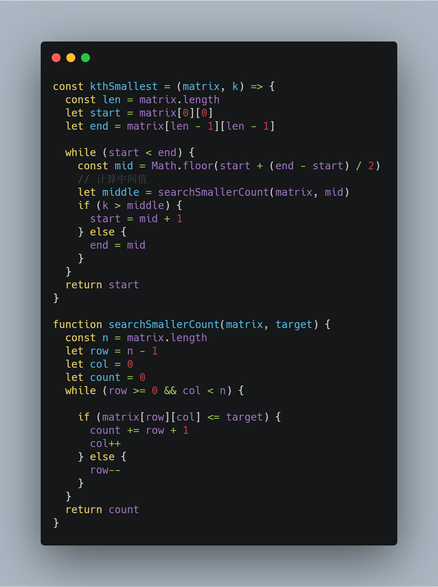
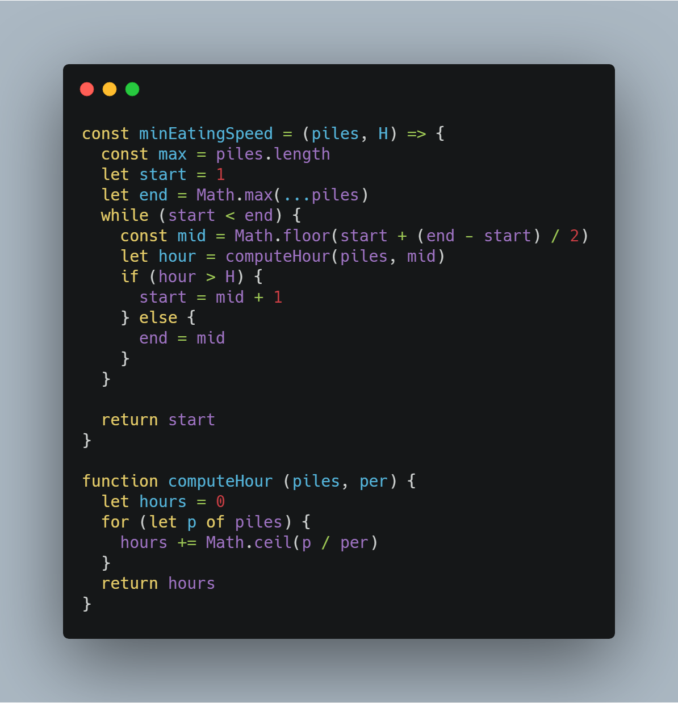
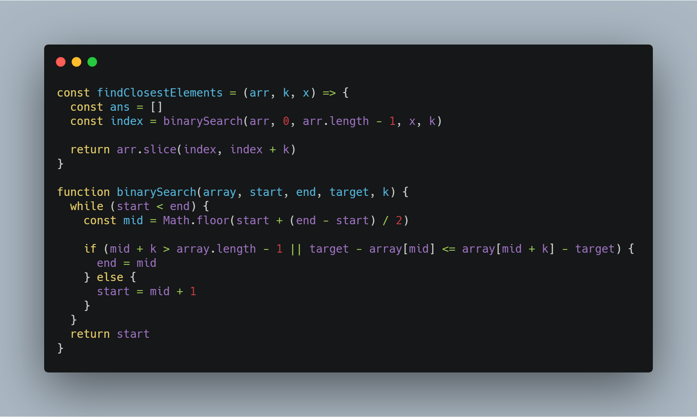
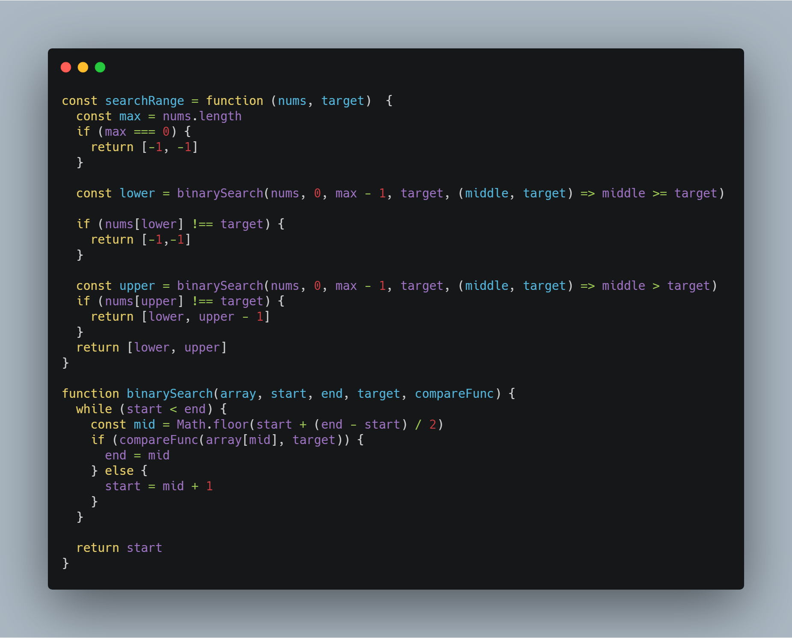

# 前端工程师的 LeetCode 之旅 -- 二分搜索算法 Medium 篇（上）

### 一、前言

  &emsp;&emsp;错过上一篇的小伙伴们，可以先阅读[前端工程师的 LeetCode 之旅 -- 二分搜索算法 Easy 篇](https://mp.weixin.qq.com/s/D6zY08tJ8J-nhIA4u86IoA)，了解一下二分搜索算法的实现原理以及如何利用 JavaScript 语言实现该算法。

  &emsp;&emsp;二分搜索算法本身并不是特别复杂，核心点主要集中在：

  - **有序数组：指的是一个递增或者递减的区间（特殊情况如：【852. 山脉数组的峰顶索引】）**；
  - **中间数：用来确定搜索目标落在左半区间还是右半区间**；

  &emsp;&emsp;进入 Medium 难度之后，这两个条件一般不会直接给出，需要解题者根据题目自行构造。

### 二、LeetCode 实战

##### 1、378. 有序矩阵中第K小的元素

  &emsp;&emsp;由水平和垂直方向为递增数组的条件，可以得到当前二维空间中的左上角为最小值，右下角为最大值，所以**有序数组即为最小值到最大值的整数递增序列**。

  &emsp;&emsp;题目要求计算出第 k 小的元素，那么从有序数组中挑选出来的中间数并不能直接与 k 进行比较，需要在二维空间中找出当前中间数是第几小的数字，再与 k 进行比较：

  - 如果当前中间数比第 k 小的元素要大，那么第 k 小元素必然在左半区间；
  - 否则必然落在右半区间；

  &emsp;&emsp;通过当前二维数组水平和垂直方向单调递增的特性，可以从**左下角开始搜索**当前中间数为第几小的数字。

  

  &emsp;&emsp;类似解题思路的还有：

  - 【74. 搜索二维矩阵】

##### 2、875. 爱吃香蕉的珂珂

  &emsp;&emsp;这道题要求我们找出一个最慢吃香蕉的速度，使得在 H 小时可以吃完 N 堆香蕉。

  &emsp;&emsp;珂珂最慢吃香蕉的速度是每个小时吃1根，最快的速度是每小时吃掉 max(N)，**有序数组即为 1 到 max(N) 的整数递增序列**。

  &emsp;&emsp;从有序数组中找出一个速度之后，还需要**计算当前速度下吃完所有香蕉所需的时间和 H 相比较**：

  - 如果当前速度下吃完所有香蕉的时间大于 H，那么所需要搜索的速度 K 必然落在右半区间；
  - 反之，K 落在左半区间；

  

##### 3、658. 找到 K 个最接近的元素

  &emsp;&emsp;这道题要求我们找到一个起始下标 index，使得 [index, index + k) 中的数字最靠近 x 。

  &emsp;&emsp;该题并没有隐藏有序数组这一条件，所以这道题目的难点在于如何通过中间下标来判断 index 落在哪个区间：

  - 首先考虑数组边界的问题，如果 mid + k > arr.length - 1，那么 index 必然在落在左半区间；
  - 接下来利用最靠近 x 和优先选择最小元素（也就是优先选择左边的元素）这两个条件：如果距离 x 左边的差值小于距离 x 右边的差值，那么 index 必然落在左半区间；

  

  &emsp;&emsp;类似解题思路的题目还有：

  - 【275. H指数 II】

##### 4、34. 在排序数组中查找元素的第一个和最后一个位置

  &emsp;&emsp;这道题目相对比较简单，但是它与前面题目的差异在于：搜索目标不一定存在有序数组中，那么在搜索结束后，就需要注意特殊情况的处理。

  &emsp;&emsp;通过两次二分搜索找出目标值的上下界限下标，再将上下界限值与目标值进行比对，从而得出正确的开始下标和结束下标：

  

### 写在最后

  &emsp;&emsp;算法作为计算机的基础学科，用 JavaScript 刷，一点也不丢人ε=ε=ε=┏(゜ロ゜;)┛。

  &emsp;&emsp;本系列文章会分别给出一种算法的3种难度的总结篇（简单难度，中等难度以及困难难度）。在简单难度中，会介绍该算法的基本知识与实现，另外两个难度，着重讲解解题的思路。
  
  &emsp;&emsp;如果本文对您有所帮助，可以点赞或者关注来鼓励博主。

- [前端工程师的 LeetCode 之旅 -- 二分搜索Easy篇](https://mp.weixin.qq.com/s/D6zY08tJ8J-nhIA4u86IoA)
- [前端工程师的 LeetCode 之旅](https://github.com/15751165579/LeetCode)