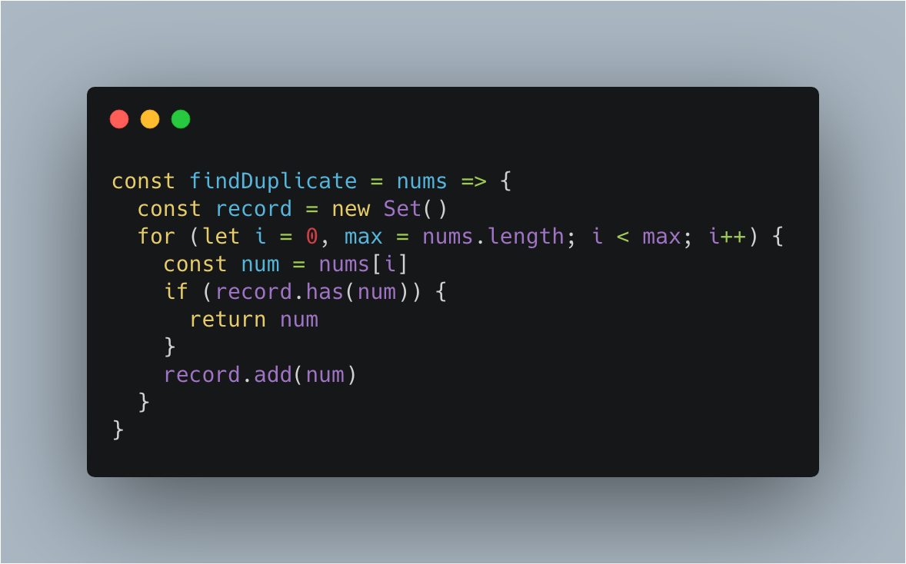
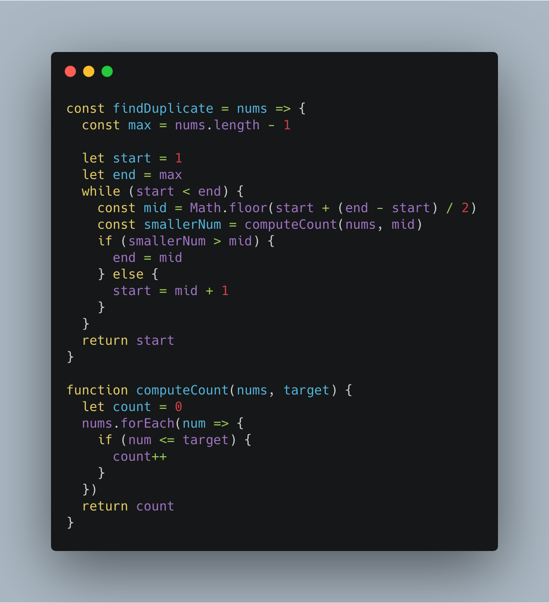
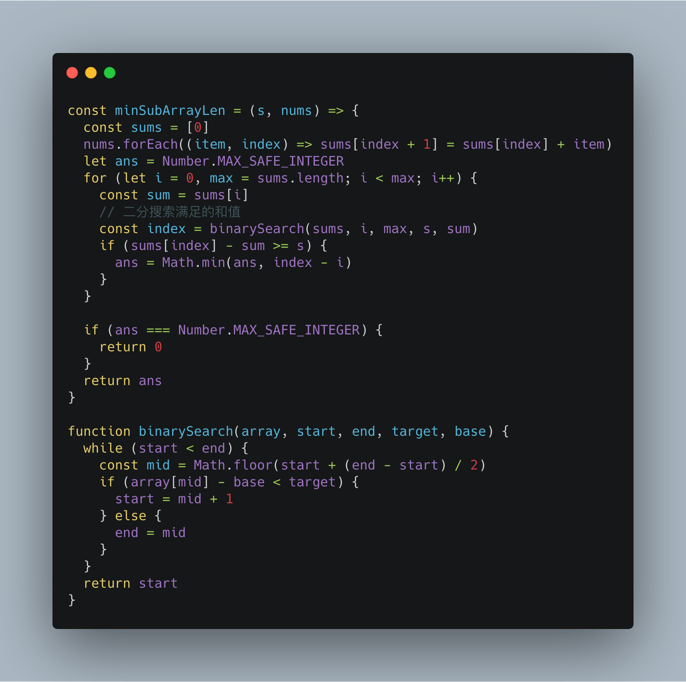
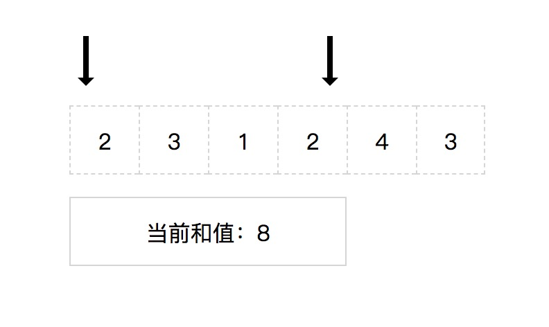
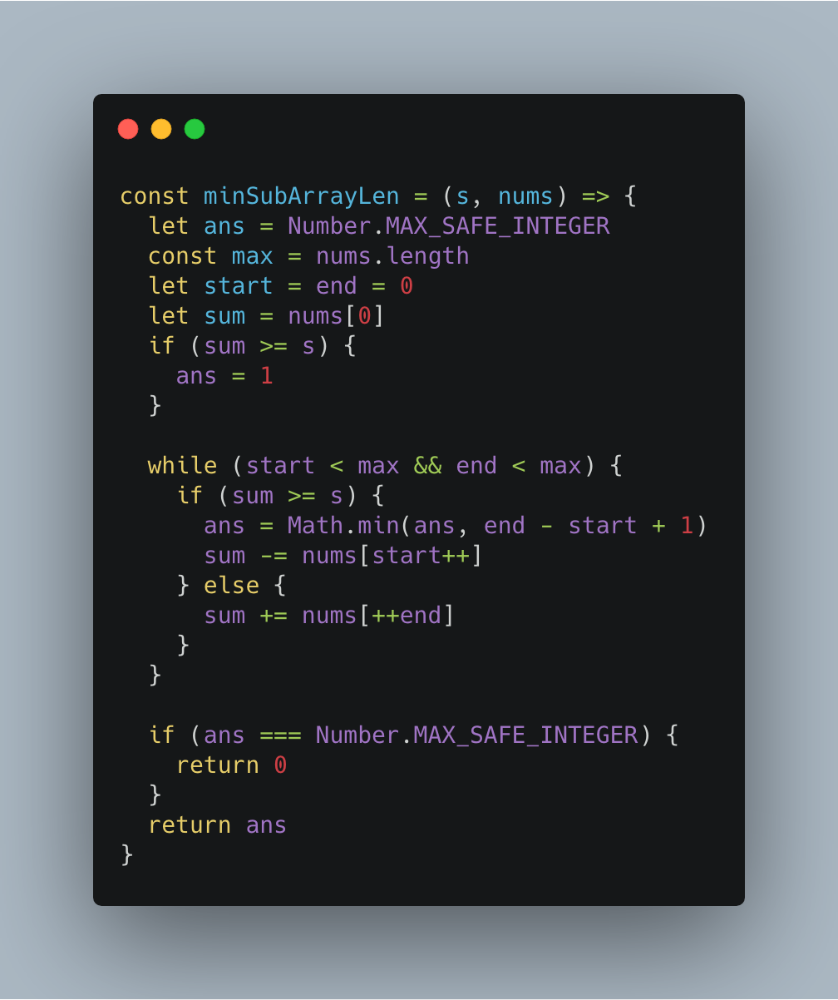
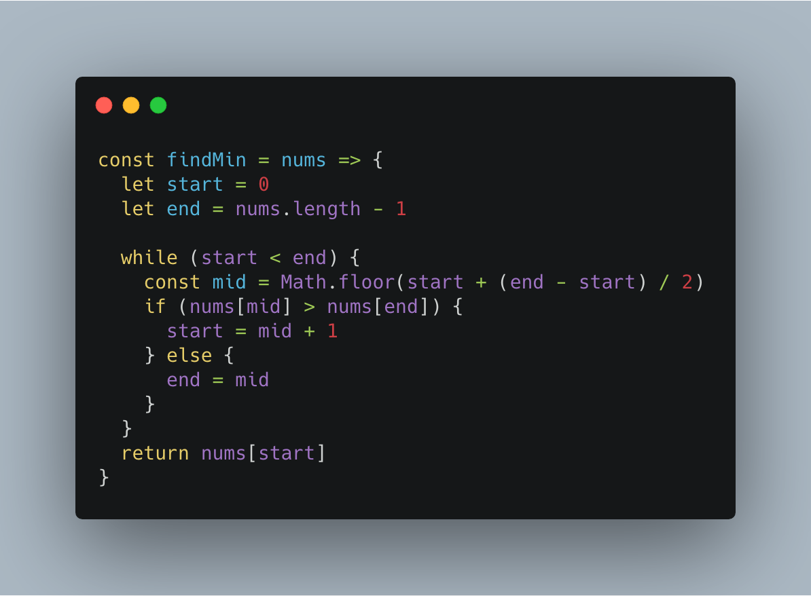
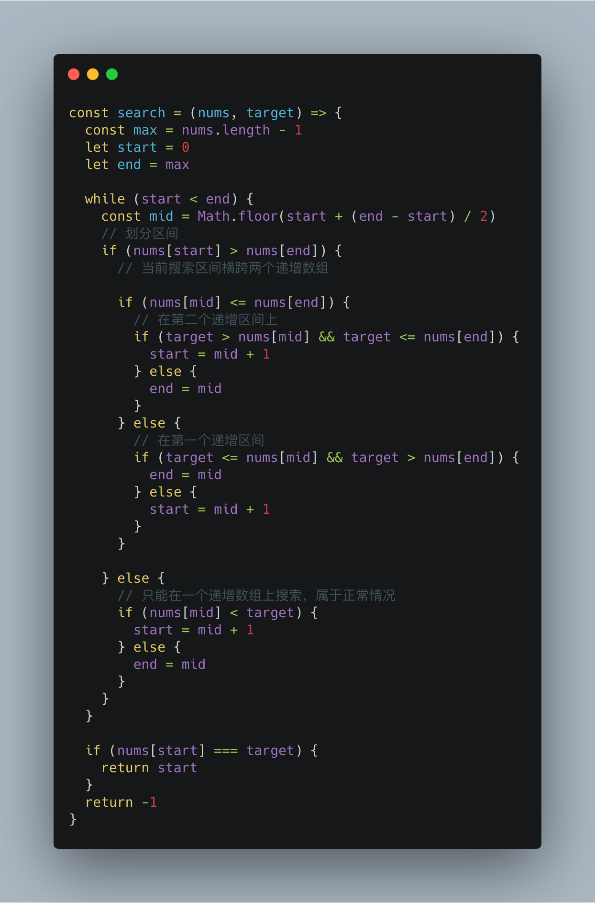

# 前端工程师的 LeetCode 之旅 -- 二分搜索算法 Medium 篇（下）

### 一、287. 寻找重复数

  > 给定一个包含 n + 1 个整数的数组 nums，其数字都在 1 到 n 之间（包括 1 和 n），可知至少存在一个重复的整数。假设只有一个重复的整数，找出这个重复的数。

##### 1、HashMap

  &emsp;&emsp;在没有其它附加条件的情况下，读者第一时间会想到通过 HashMap 来记录出现过的数字，从而找到重复数：

  

  &emsp;&emsp;上述实现代码的时间复杂度和空间复杂度都为 O(n)，如果只允许使用 O(1) 的空间复杂度，该如何解决这道题目呢？

##### 2、Binary Search

  &emsp;&emsp;这种条件下，最容易想到的就是通过两重循环暴力搜索当前数字是否与后面的数字重复的方法来解决，但是这种方案的时间复杂度为 O(n^2)，既然涉及到了搜索，就可以尝试通过二分搜索算法将时间复杂度降低到 O(nlogn)。

  &emsp;&emsp;根据前面的刷题经验，可以很容易地找出有序数组：**1 到 n 的递增整数序列**。

  &emsp;&emsp;接下来的难点就是通过重复数的特性来确定下一轮搜索区间是落在左半区间还是右半区间：
  
  - 首先需要遍历 nums 数组，获取不大于当前中间数的数字的个数；
  - **如果个数大于中间数，那么下一轮搜索区间落在左半区间；**
  - **如果个数小于中间数，那么下一轮搜索区间落在右半区间；**

  

### 二、209. 长度最小的子数组

  > 给定一个含有 n 个正整数的数组和一个正整数 s ，找出该数组中满足其和 ≥ s 的长度最小的连续子数组。如果不存在符合条件的连续子数组，返回 0。

##### 1、Binary Search

  &emsp;&emsp;这道题目中的有序数组不太好找，需要用到一个技巧：**构造前缀和数组**。

```s
  nums = [2, 3, 1, 2, 4, 3]

  # 前缀和
  sums = [0, 2, 5, 6, 8, 12, 15]
```

  &emsp;&emsp;从而上述示例中可以发现前缀和数组是一个有序数组，**那么对于任意 i 到 j 的连续子数组之和，可以通过 sums[j+1] - sums[i] 求出**。

  &emsp;&emsp;并且根据前缀和的差值与 s 的比较，可以判断满足条件的连续子数组的终止下标落在哪个区间内。

  


  &emsp;&emsp;通过前缀和对数组的预处理以及二分搜索算法，时间复杂度为 O(nlogn)。

##### 2、Two Points

  &emsp;&emsp;除了上述二分搜索算法的处理方法之外，可能最简单暴力的方法就是通过嵌套循环找出长度最小的连续子数组，但是这种方法的时间复杂度为 O(n^2)，有没有方法将其降低到 O(n) 的时间复杂度呢？。

  &emsp;&emsp;这里就要提及一下**滑动窗口算法**，它常用于处理连续子元素问题，将嵌套循环问题转化为单循环问题。

  

  &emsp;&emsp;在本题中，通过头指针和尾指针维护当前连续子数组的和值窗口：

  - 当前窗口的和值大于 s ，那么头指针向后移动一位；
  - 当前窗口的和值小于 s ，那么尾指针向后移动一位；

  

### 三、153. 寻找旋转排序数组中的最小值

  > 假设按照升序排序的数组在预先未知的某个点上进行了旋转。( 例如，数组 [0,1,2,4,5,6,7] 可能变为 [4,5,6,7,0,1,2] )。请找出其中最小的元素。你可以假设数组中不存在重复元素。

  &emsp;&emsp;这一类型的题目在 Easy 中也出现过，如：【852. 山脉数组的峰顶索引】和【162. 寻找峰值】。

  &emsp;&emsp;本题中，原本的递增数组被转化成包含两个递增序列的数组，并且其中无重复元素，那么就可以得出：**第一个递增数组中的任意一个元素都大于第二个递增数组中的元素**。

  &emsp;&emsp;有了这一关键信息，对于任一中间数，都可以将其与当前搜索区间的最后一个元素相比较，从而知道当前中间数在哪一个递增序列上，而所求的最小值存在于第二个递增序列的头部，那么不断将搜索区间往这一方向收缩，即可得到最小值：

  

### 四、33. 搜索旋转排序数组

  > 假设按照升序排序的数组在预先未知的某个点上进行了旋转。( 例如，数组 [0,1,2,4,5,6,7] 可能变为 [4,5,6,7,0,1,2] )。搜索一个给定的目标值，如果数组中存在这个目标值，则返回它的索引，否则返回 -1 。你可以假设数组中不存在重复的元素。你的算法时间复杂度必须是 O(log n) 级别。

  &emsp;&emsp;这道题是【153. 寻找旋转排序数组中的最小值】的进阶题型。

  &emsp;&emsp;在 153 中，只需要将搜索区间不断向第二个递增区间收缩，即可得到最小值。而本题中的目标值的位置并不确定，所以在每次确定搜索区间时，需要考虑很多种情况：

  - **如果当前搜索区间只落在一个递增区间上，那么和一般的处理方法没什么异样；**
  - **如果当前搜索区间横跨两个递增区间，那么就需要根据中间数在第一个递增区间还是第二个递增区间上分别处理；**

  &emsp;&emsp;具体的条件判断，请查看下面的代码实现：

  

### 五、81. 搜索旋转排序数组 II

  > 假设按照升序排序的数组在预先未知的某个点上进行了旋转。( 例如，数组 [0,0,1,2,2,5,6] 可能变为 [2,5,6,0,0,1,2] )。编写一个函数来判断给定的目标值是否存在于数组中。若存在返回 true，否则返回 false。

  &emsp;&emsp;这道题目在【33. 搜索旋转排序数组】的基础上去除了”不存在重复元素“这一条件。

  &emsp;&emsp;回顾 33 题的解法，在寻找下一个搜索区间时，通过该搜索区间的头部元素和尾部元素的比较得出当前搜索区间是否横跨两个递增序列。一旦没有无重复元素这一条件，那么根据头尾两个元素无法判断当前搜索区间是否横跨两个递增序列。

  &emsp;&emsp;本题要求计算元素的存在性，那么一个元素的重复元素对其存在性是没有任何影响的，所以只要在二分搜索的过程中，剔除掉头尾部的重复元素即可：

  


### 写在最后

  &emsp;&emsp;算法作为计算机的基础学科，用 JavaScript 刷，一点也不丢人ε=ε=ε=┏(゜ロ゜;)┛。

  &emsp;&emsp;本系列文章会分别给出一种算法的3种难度的总结篇（简单难度，中等难度以及困难难度）。在简单难度中，会介绍该算法的基本知识与实现，另外两个难度，着重讲解解题的思路。
  
  &emsp;&emsp;如果本文对您有所帮助，可以点赞或者关注来鼓励博主。

- [前端工程师的 LeetCode 之旅 -- 二分搜索 Medium 篇（上）](https://mp.weixin.qq.com/s/W-z820EkMagQsZafJdEZrw)
- [前端工程师的 LeetCode 之旅 -- 二分搜索Easy篇](https://mp.weixin.qq.com/s/D6zY08tJ8J-nhIA4u86IoA)
- [前端工程师的 LeetCode 之旅](https://github.com/15751165579/LeetCode)


