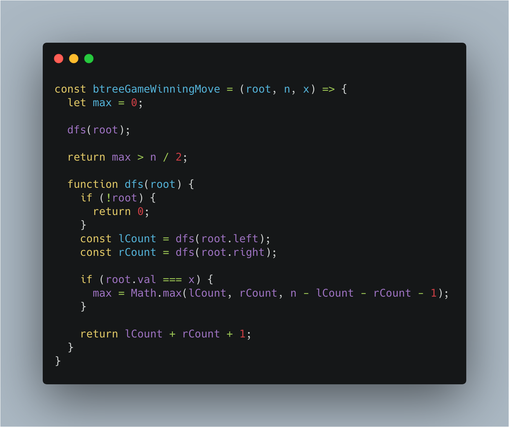

# 前端工程师的 LeetCode 之旅 - 1145、二叉树着色游戏

### 一、题目大意

  &emsp;&emsp;有两位极客玩家参与了一场「二叉树着色」的游戏。游戏中，给出二叉树的根节点 root，树上总共有 n 个节点，且 n 为奇数，其中每个节点上的值从 1 到 n 各不相同。

  &emsp;&emsp;游戏从「一号」玩家开始（「一号」玩家为红色，「二号」玩家为蓝色），最开始时：

  - 「一号」玩家从 [1, n] 中取一个值 x（1 <= x <= n）；
  - 「二号」玩家也从 [1, n] 中取一个值 y（1 <= y <= n）且 y != x。
  - 「一号」玩家给值为 x 的节点染上红色，而「二号」玩家给值为 y 的节点染上蓝色。

  &emsp;&emsp;之后两位玩家轮流进行操作，每一回合，玩家选择一个他之前涂好颜色的节点，将所选节点一个 未着色 的邻节点（即左右子节点、或父节点）进行染色。

  &emsp;&emsp;如果当前玩家无法找到这样的节点来染色时，他的回合就会被跳过。
  
  &emsp;&emsp;若两个玩家都没有可以染色的节点时，游戏结束。着色节点最多的那位玩家获得胜利 ✌️。

  &emsp;&emsp;现在，假设你是「二号」玩家，根据所给出的输入，假如存在一个 y 值可以确保你赢得这场游戏，则返回 true；若无法获胜，就请返回 false。

### 二、解题思路

  &emsp;&emsp;本题的解题关键是：**每一回合，玩家选择一个他之前涂好颜色的节点，将所选节点一个未着色的邻节点（即左右子节点、或父节点）进行染色**。

  &emsp;&emsp;那么「二号」玩家着色的节点只能分布在「一号」玩家初始节点的三个方向之一，如果想确保「二号」玩家能够胜出，那么「二号」玩家应该尽可能占满该方向的节点。

  &emsp;&emsp;初始红色节点的父节点方向的节点数记为**X**，初始红色节点的左子树方向的节点数记为**Y**，初始红色节点的右子树方向的节点数记为**Z**，那么「二号」玩家胜出的情况如下：

  - X > Y + Z + 1，「二号」玩家胜出；
  - Y > X + Z + 1，「二号」玩家胜出；
  - Z > X + Y + 1，「二号」玩家胜出；

### 三、解题代码

  &emsp;&emsp;有了上述解题思路，代码实现主要分为以下两步：

  - 遍历二叉树，记录三个方向的节点数；
  - 判断三种「二号」玩家胜出的情况。

  

### 四、简化代码​

  &emsp;&emsp;上述解题思路中，有以下几点可以大大简化代码：

  - **题目中已经给出了节点的总数，所以只要知道任意两个方向的节点数，即可算出第三个方向的节点数，那么利用递归的特性，可以在递归的过程中返回子树的节点数，那么就可以知道当前节点的左右子树的节点数，从而简化大量的代码**；
  - **只要保证「二号」玩家填充的节点数大于总节点数的一半，即可保证「二号」玩家胜出，简化前面三种情况的判断**

  

### 写在最后

  &emsp;&emsp;算法作为计算机的基础学科，用 JavaScript 刷，一点也不丢人ε=ε=ε=┏(゜ロ゜;)┛。

  &emsp;&emsp;本系列文章会分别给出一种算法的3种难度的总结篇（简单难度，中等难度以及困难难度）。在简单难度中，会介绍该算法的基本知识与实现，另外两个难度，着重讲解解题的思路。

  &emsp;&emsp;每篇总结中会选取部分重点题目讲解，完整解题清单详见[【前端工程师的 LeetCode 之旅】](https://github.com/15751165579/LeetCode)
  
  &emsp;&emsp;如果本文对您有所帮助，可以点赞或者关注来鼓励博主。

- [前端工程师的 LeetCode 之旅 -- 二叉树 Easy 篇](https://mp.weixin.qq.com/s/NNIn8BLUIBWCvEjYgzb2mg)
- [前端工程师的 LeetCode 之旅 -- 二叉树 Medium 篇（DFS 和 BFS）](https://mp.weixin.qq.com/s/FFCVLfndgtIaxwIGiDAGiA)
- [前端工程师的 LeetCode 之旅 -- 二叉树 Medium 篇（根据遍历序列构造二叉树）](https://mp.weixin.qq.com/s/g46dFFNOyEh9W4dY61NV7g)