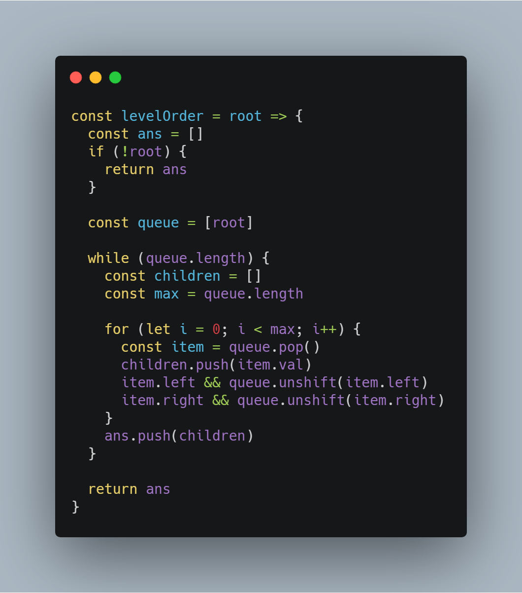
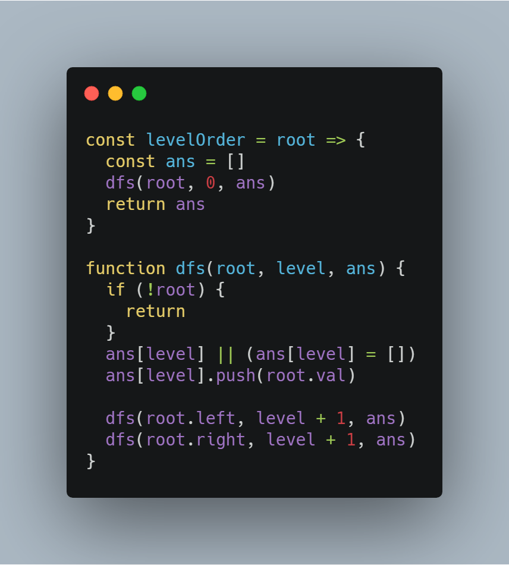
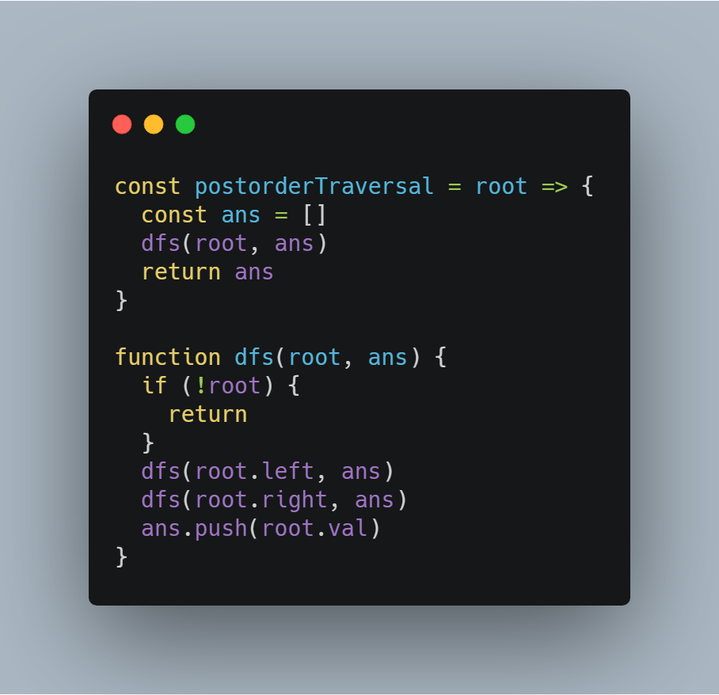
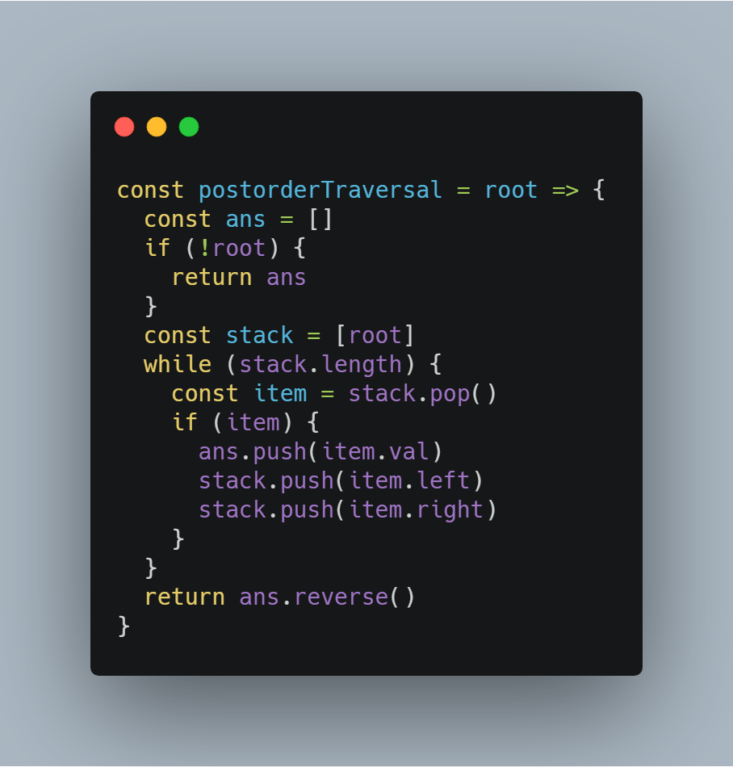
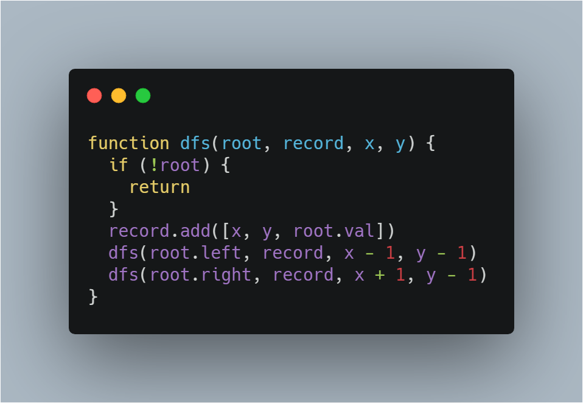
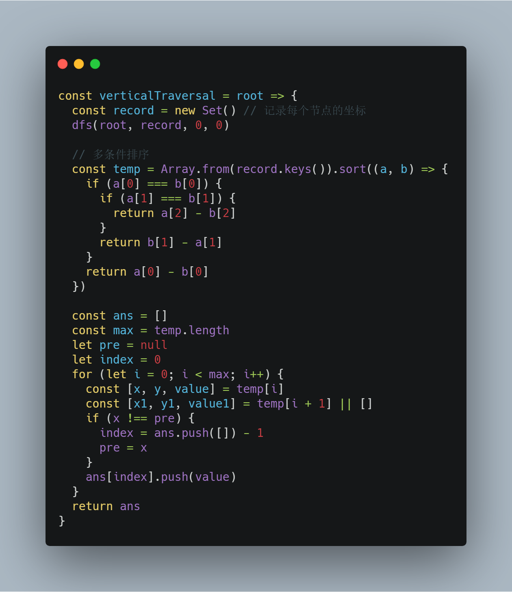

# 前端工程师的 LeetCode 之旅 -- 二叉树 Medium 篇（DFS 与 BFS）

### 一、前言

  &emsp;&emsp;Medium 难度主要考察结合二叉树性质的 CRUD 操作，而这一切的基础都离不开遍历二叉树。

  &emsp;&emsp;二叉树是图的子集，因而同样适用以下两种搜索思想：

  - **DFS（深度优先搜索）：沿着根节点递归下去，遇到叶子节点则向上回溯**；
  - **BFS (广度优先搜索)：按照二叉树的层次访问，通常采用队列保存每个层次的节点**。

  &emsp;&emsp;由于二叉树本身的定义就是递归的，所以采用递归处理起来，代码更容易理解。但是递归的效率相对比较慢，主要原因在于：**一个函数被调用的时间和空间成本开销很大，递归太多还有可能导致调用栈溢出问题**。前文也提到可以采用尾递归的书写方式，让 JavaScript 引擎去将递归优化成迭代，从而解决性能上的问题。

  &emsp;&emsp;但是在一些情况下，尾递归并没有那么好写，所以本文会同时给出递归和迭代的解决方案。

  &emsp;&emsp;接下来，通过具体的题目解析，带大家了解 DFS 和 BFS 搜索思想在二叉树中的应用。

### 二、102. 二叉树的层次遍历

  > 给定一个二叉树，返回其按层次遍历的节点值。 （即逐层地，从左到右访问所有节点）。

##### 1、BFS

  &emsp;&emsp;这道题目要求按层次遍历节点，很符合 BFS 搜索思想的定义，所以代码也很好理解。

  &emsp;&emsp;这里需要**利用队列（queue）来保存每一层需要访问的节点**，需要特别注意队列的特性是**先进先出**，而本题要求每一层从左到右遍历，所以需要先将左子树放入队列。

  

##### 2、DFS

  &emsp;&emsp;采用 DFS 搜索思想，需要注意在**递归的过程中记录当前节点的层次信息**：

  

### 三、145. 二叉树的后序遍历

  > 给定一个二叉树，返回它的 后序 遍历。

  &emsp;&emsp;二叉树中最常见的就是按照根节点访问次序定义的三种遍历方式：

  - 先序遍历：首先访问根，再先序遍历遍历左子树，最后先序遍历右子树；
  - 中序遍历：首先中序遍历左子树，再访问根，最后中序遍历右子树；
  - 后序遍历：首先后序遍历左子树，再后序遍历右子树，最后访问根；

  &emsp;&emsp;以本道题的后序遍历为例，尝试通过递归和迭代两种不同的方案处理：

##### 1、递归实现 DFS

  &emsp;&emsp;从定义中，大家应该能够想象到递归的代码如何书写：

  

##### 2、迭代实现 DFS

  &emsp;&emsp;本道题目采用迭代实现 BFS 不太容易理解，主要在迭代不能像递归那样向上回溯，所以迭代向下遍历的过程中，无法保证根节点最后访问。

  &emsp;&emsp;在回顾一下后序遍历最终得到的序列：

```JavaScript
  左子树 --> 右子树 --> 根
```

  &emsp;&emsp;如果必须先访问根节点，那么是不是可以得到这样的序列：

```JavaScript
  根 --> 右子树 --> 左子树
```

  &emsp;&emsp;最后，再将该序列反转，是不是就是本题所要求解的后序遍历！

  &emsp;&emsp;这里我们利用栈**后进先出**的特性，最后将右子树推进栈，使得右子树先进行深度搜索：

  

### 四、987. 二叉树的垂序遍历

  > 给定二叉树，按垂序遍历返回其结点值。对位于 (X, Y) 的每个结点而言，其左右子结点分别位于 (X-1, Y-1) 和 (X+1, Y-1)。把一条垂线从 X = -infinity 移动到 X = +infinity ，每当该垂线与结点接触时，我们按从上到下的顺序报告结点的值（ Y 坐标递减）。如果两个结点位置相同，则首先报告的结点值较小。按 X 坐标顺序返回非空报告的列表。每个报告都有一个结点值列表。

  &emsp;&emsp;最后，通过本道题目来开启 Medium 难度题型的讲解。

  &emsp;&emsp;这道题目要求我们求出垂序遍历序列，那么首先还是得先遍历二叉树，这里采用递归实现 DFS 来遍历二叉树。

  &emsp;&emsp;在递归的过程中需要向下传递坐标信息，并且通过 HashTable 记录各个节点三元组（ x 坐标、y 坐标，节点值），以便后续构造垂序序列：

  

  &emsp;&emsp;得到坐标之后，需要对三元组进行综合排序，最后再根据水平坐标构造垂序遍历序列，时间复杂度 O(nlogn)。

  

### 写在最后

  &emsp;&emsp;算法作为计算机的基础学科，用 JavaScript 刷，一点也不丢人ε=ε=ε=┏(゜ロ゜;)┛。

  &emsp;&emsp;本系列文章会分别给出一种算法的3种难度的总结篇（简单难度，中等难度以及困难难度）。在简单难度中，会介绍该算法的基本知识与实现，另外两个难度，着重讲解解题的思路。

  &emsp;&emsp;每篇总结中会选取部分重点题目讲解，完整解题清单详见[【前端工程师的 LeetCode 之旅】](https://github.com/15751165579/LeetCode)
  
  &emsp;&emsp;如果本文对您有所帮助，可以点赞或者关注来鼓励博主。


- [前端工程师的 LeetCode 之旅 -- 二叉树 Easy 篇](https://mp.weixin.qq.com/s/NNIn8BLUIBWCvEjYgzb2mg)