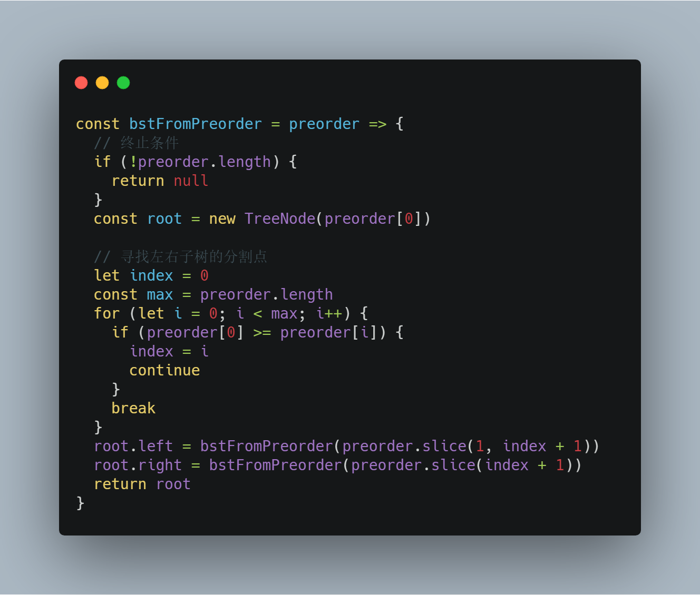
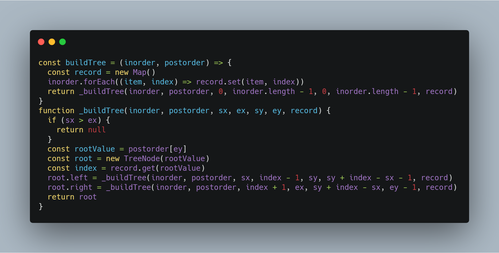
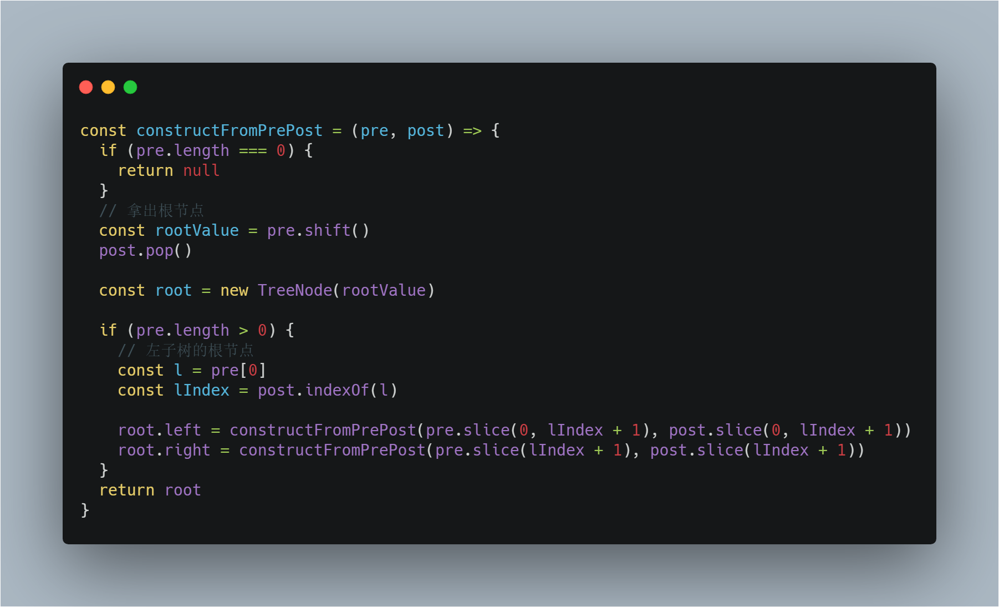

# 前端工程师的 LeetCode 之旅 -- 二叉树 Medium 篇（根据遍历序列构造二叉树）

### 一、前言

  &emsp;&emsp;上一篇中介绍了如何采用 DFS 和 BFS 的搜索思想去实现二叉树的前序遍历、中序遍历、后序遍历以及分层遍历。

  &emsp;&emsp;这一节主要介绍 Medium 难度中比较常见的一种题型：**根据各种遍历构造二叉树**。

### 二、1008. 先序遍历构造二叉树

  > 返回与给定先序遍历 preorder 相匹配的二叉搜索树（binary search tree）的根结点

  &emsp;&emsp;本道题目要求构造一棵 BST，使得它的前序遍历序列与给定的 preorder 匹配。

  &emsp;&emsp;首先，对二叉树进行前序遍历，可以得到如下序列：

```s
  根节点 --> 左子树 --> 右子树
```

  &emsp;&emsp;显然，根据前序序列，可以确定第一个元素就是根节点，那么接下来的问题就是如何找到左右子树的分割点？

  &emsp;&emsp;回忆一下 BST 的特性：

  - 左子树的元素都比根元素小；
  - 右子树的元素都比根元素大；
  - BST 中不存在重复的元素；

  &emsp;&emsp;结合上述性质：**通过根节点与序列中元素的大小比较可以得到左右子树的分割点**。

  

### 三、105. 从前序与中序遍历序列构造二叉树

  > 根据一棵树的前序遍历与中序遍历构造二叉树。注意: 你可以假设树中没有重复的元素。

  &emsp;&emsp;本道题目要求构造一棵普通的二叉树，而非 BST。

```s
  前序遍历：根节点 --> 左子树 --> 右子树
  中序遍历: 左子树 --> 根节点 --> 右子树
```

  &emsp;&emsp;从上述两个遍历序列中，大家应该已经发现分割左右子树的条件就藏在中序遍历中。

  &emsp;&emsp;**根据前序遍历得到根元素，再遍历中序遍历序列得到根元素的下标，从而分割左右子树**。如果二叉树中存在重复元素，那么这种方案是行不通的，这也是此类型题目一个重要的条件。

  

### 四、106. 从中序与后序遍历序列构造二叉树

  > 根据一棵树的中序遍历与后序遍历构造二叉树。注意:你可以假设树中没有重复的元素。

  &emsp;&emsp;本题的解题思路与上一道题的解题思路如出一辙，所以正好借用本道题目介绍一下时间复杂度的优化。

  &emsp;&emsp;上一题解题代码的耗时操作主要在于频繁地使用 shift、indexOf 和 slice。

  &emsp;&emsp;**对于 indexOf 操作，可以采用 HashTable 代替，这是经典的空间换时间的优化方式。**

  &emsp;&emsp;**而对于 shift 和 slice，可以采用多指针记录下标来处理**。这里的下标计算有点复杂，建议大家自己画一画遍历的过程，不然很难明白写法的推导过程。

  

### 五、889. 根据前序和后序遍历构造二叉树

  > 返回与给定的前序和后序遍历匹配的任何二叉树。pre 和 post 遍历中的值是不同的正整数。

  &emsp;&emsp;还是老套路，先观察两个遍历序列：

```s
  前序遍历：根节点 --> 左子树 --> 右子树
  后序遍历：左子树 --> 右子树 --> 根节点
```

  &emsp;&emsp;这不是熟悉的感觉啊，看来看去，根节点也不好将左右子树分割啊！?

  &emsp;&emsp;现在，尝试展开左右子树：

```s
  前序遍历：根节点 --> (根节点 --> 左子树 --> 右子树) --> 右子树
  后续遍历：(左子树 --> 右子树 --> 根节点) --> 右子树 --> 根节点
```

  &emsp;&emsp;是不是有点明朗了，再把左右根节点去掉，是不是发现根据左子树的根节点，可以将左右子树分割开呀。

```s
  前序遍历：(根节点 --> 左子树 --> 右子树) --> 右子树
  后续遍历：(左子树 --> 右子树 --> 根节点) --> 右子树
```

  


### 写在最后

  &emsp;&emsp;算法作为计算机的基础学科，用 JavaScript 刷，一点也不丢人ε=ε=ε=┏(゜ロ゜;)┛。

  &emsp;&emsp;本系列文章会分别给出一种算法的3种难度的总结篇（简单难度，中等难度以及困难难度）。在简单难度中，会介绍该算法的基本知识与实现，另外两个难度，着重讲解解题的思路。

  &emsp;&emsp;每篇总结中会选取部分重点题目讲解，完整解题清单详见[【前端工程师的 LeetCode 之旅】](https://github.com/15751165579/LeetCode)
  
  &emsp;&emsp;如果本文对您有所帮助，可以点赞或者关注来鼓励博主。


- [前端工程师的 LeetCode 之旅 -- 二叉树 Easy 篇](https://mp.weixin.qq.com/s/NNIn8BLUIBWCvEjYgzb2mg)
- [前端工程师的 LeetCode 之旅 -- 二叉树 Medium 篇（DFS 和 BFS）](https://mp.weixin.qq.com/s/FFCVLfndgtIaxwIGiDAGiA)