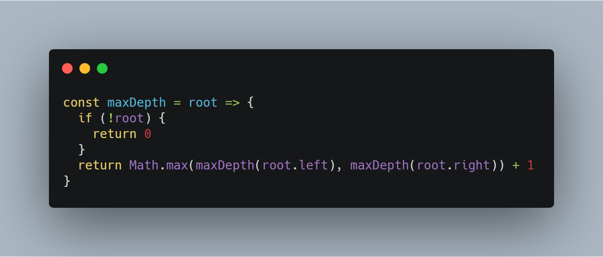
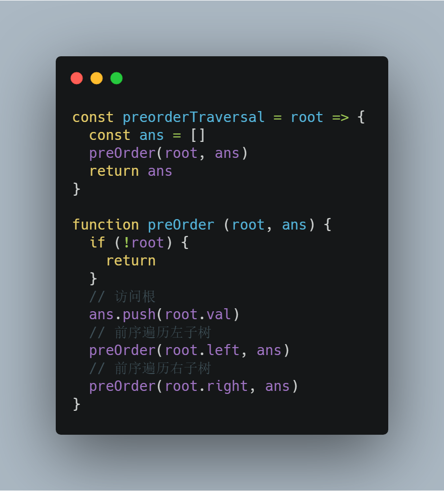
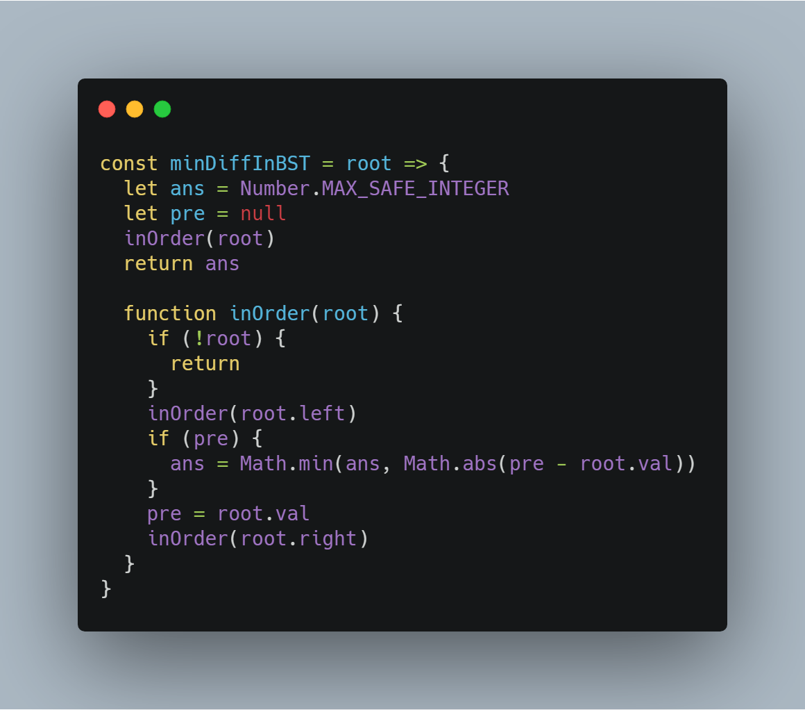
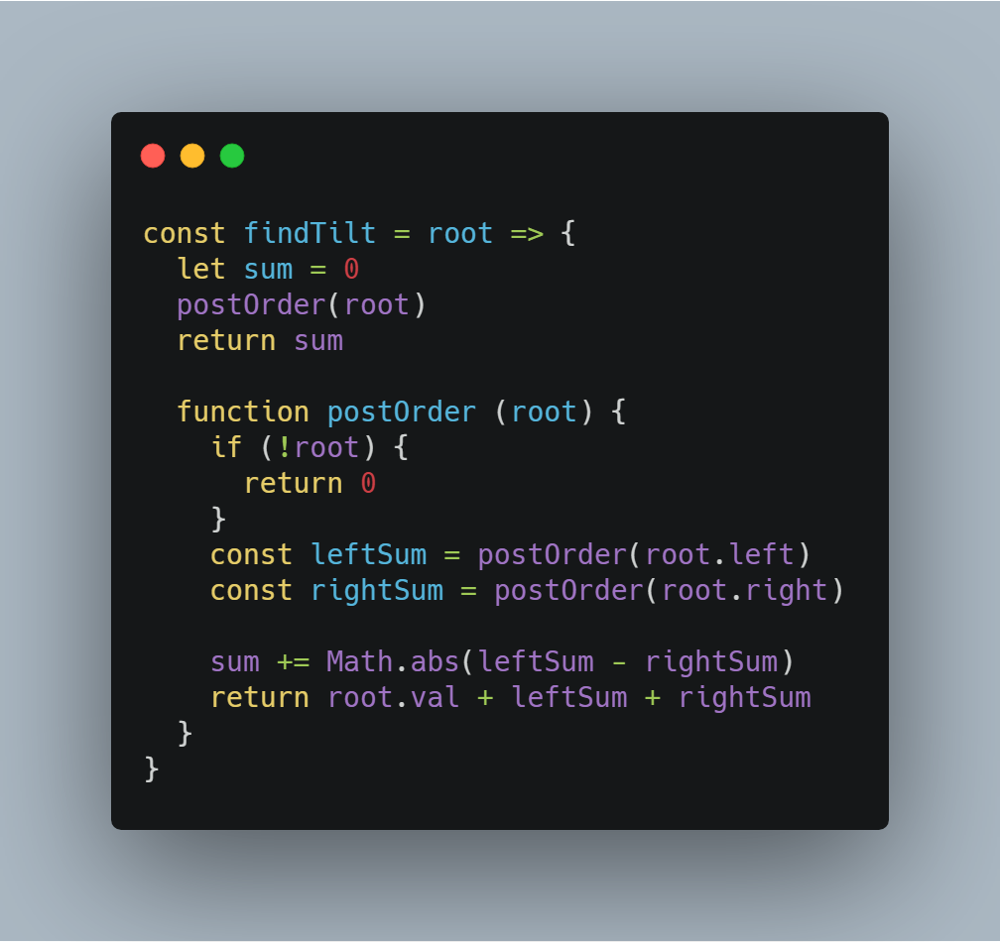
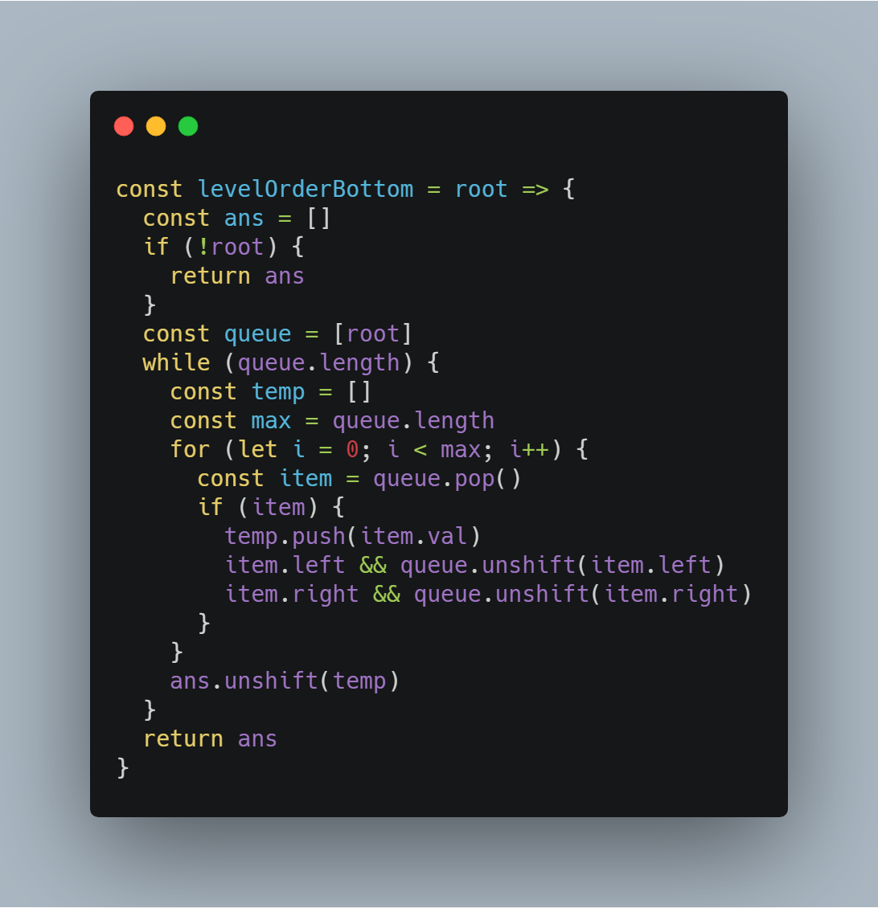
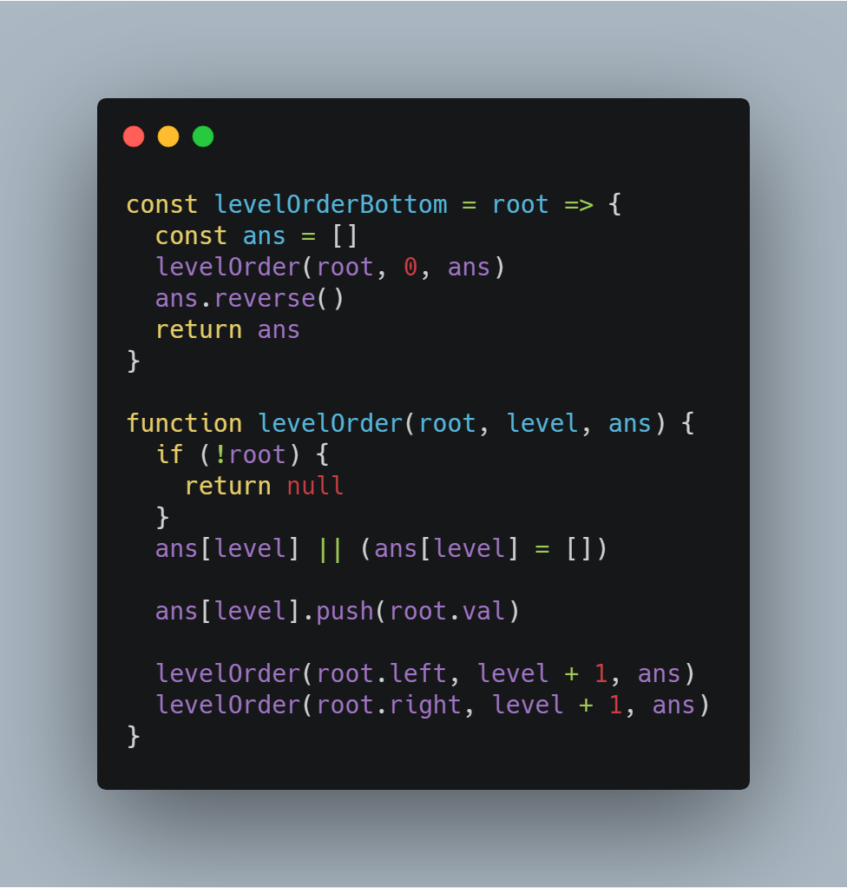
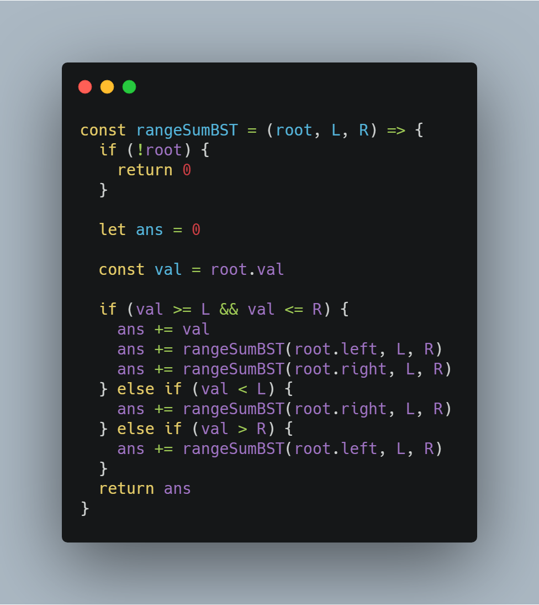
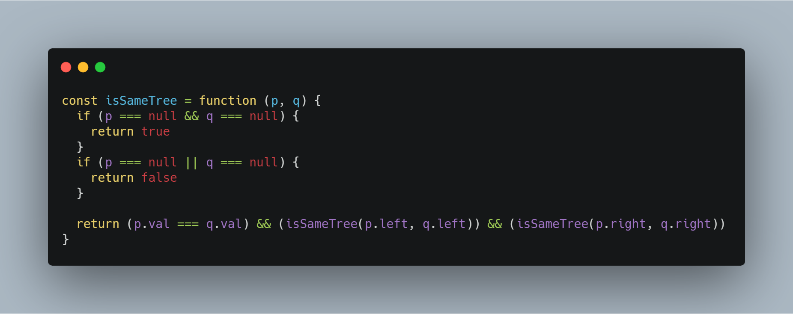

# 前端工程师的 LeetCode 之旅 -- 二叉树 Easy 篇

### 一、前言

  &emsp;&emsp;本篇难度的题目主要考察对于二叉树的基本概念与操作的理解。

##### 1、基本概念

  &emsp;&emsp;树是计算机科学中经常用到的一种非线性数据结构，以分层的形式存储数据。二叉树是一种特殊的树结构，它每个节点最多有两个子树，通常子树被称作“左子树”和“右子树”。

  

  &emsp;&emsp;以上述图片为例，介绍几个二叉树相关的术语：

  - **节点的度**：节点拥有子树的数量，例如图中节点 7 的度为 2；
  - **叶子节点**：度为 0 的节点，例如图中的节点 2 就是一个叶子节点；
  - **节点的层次**： 根节点的层定义为 1，根的孩子为第二层节点，依次类推；
  - **树的深度**：树中的最大节点层；

  &emsp;&emsp;另外二叉树也有不同的表现形态，最常见的就是二叉查找树（Binary Search Tree）,它具有以下性质：

  - 若任意节点的左子树不空，则左子树上所有节点的值均小于它的根节点的值；
  - 若任意节点的右子树不空，则右子树上所有节点的值均大于它的根节点的值；
  - 任意节点的左、右子树也分别为二叉查找树；
  - 没有键值相等的节点。

  &emsp;&emsp;二叉查找树相比较其他数据结构的优势在于查找、插入的时间复杂度较低，为 O(logn)，并且对它进行中序遍历操作，可以得到一个有序序列，所以二叉查找树成为考察的重点。

##### 2、基本操作

  &emsp;&emsp;二叉树经常考察的问题主要基于以下操作：

  - 求解二叉树的深度；
  - 先序遍历：首先访问根，再先序遍历遍历左子树，最后先序遍历右子树；
  - 中序遍历：首先中序遍历左子树，再访问根，最后中序遍历右子树；
  - 后序遍历：首先后序遍历左子树，再后序遍历右子树，最后访问根；
  - 层次遍历：按照节点的层次访问；

  &emsp;&emsp;二叉树非常适合采用递归处理，虽然递归非常耗费内存，但是它写出的代码思路清晰，可读性强，另外可以通过尾递归的书写方式，让 JavaScript 引擎将其优化为迭代的方式，从而大幅度地优化时间和空间复杂度。

### 二、104. 二叉树的最大深度

  > 给定一个二叉树，找出其最大深度。

  &emsp;&emsp;**一棵树的最大深度可以理解为根节点加上左右子树的最大深度**，那么采用递归的思想就很容易写出如下代码：

  

  &emsp;&emsp;相同类型的题目：

  - 【111. 二叉树的最小深度】；

### 三、144. 二叉树的前序遍历

  > 给定一个二叉树，返回它的 前序 遍历。

  &emsp;&emsp;二叉树遍历的递归代码看起来会非常的清晰：

  

  &emsp;&emsp;再实现中序遍历以及后序遍历，是不是小菜一碟？

### 四、783. 二叉搜索树结点最小距离

  > 给定一个二叉搜索树的根结点 root, 返回树中任意两节点的差的最小值。

  &emsp;&emsp;解题思路：**二叉搜索树中序遍历序列为递增序列**；

  

  &emsp;&emsp;相同类型的题目：

  - 【530. 二叉搜索树的最小绝对差】；
  - 【897. 递增顺序查找树】；
  - 【653. 两数之和 IV - 输入 BST】；

### 五、563. 二叉树的坡度

  > 给定一个二叉树，计算整个树的坡度。一个树的节点的坡度定义即为，该节点左子树的结点之和和右子树结点之和的差的绝对值。空结点的的坡度是0。整个树的坡度就是其所有节点的坡度之和。

  &emsp;&emsp;解题思路：**利用后序遍历的方式，先计算左子树和值以及右子树和值，再计算当前节点的坡度，最后更新当前根节点的和值**。

  

### 六、107. 二叉树的层次遍历 II

  > 给定一个二叉树，返回其节点值自底向上的层次遍历。 （即按从叶子节点所在层到根节点所在的层，逐层从左向右遍历）

  &emsp;&emsp;这是一道考察层次遍历的题目，这里介绍两种方法实现层级遍历：

##### 1、队列和栈

  &emsp;&emsp;第一种方法：**采用栈和队列维护每一层访问的节点**。

  

##### 2、递归

  &emsp;&emsp;第二种方法：**利用递归思想在前序遍历的过程中记录相应的层级**。

  

  &emsp;&emsp;同样采用层级遍历解题的还有：

  - 【637. 二叉树的层平均值】；
  - 【872. 叶子相似的树】；

### 七、938. 二叉搜索树的范围和

  > 给定二叉搜索树的根结点 root，返回 L 和 R（含）之间的所有结点的值的和。二叉搜索树保证具有唯一的值。

  &emsp;&emsp;这道题目利用二叉搜索树的特性：

  - 若任意节点的左子树不空，则左子树上所有节点的值均小于它的根节点的值；
  - 若任意节点的右子树不空，则右子树上所有节点的值均大于它的根节点的值；

  &emsp;&emsp;处理此类问题的方式与上几篇中提到的二分搜索算法有几分相似。

  

  &emsp;&emsp;相同类型的题目还有：

  - 【700. 二叉搜索树中的搜索】；
  - 【669. 修剪二叉搜索树】；
  - 【538. 把二叉搜索树转换为累加树】；

### 八、100. 相同的树

  > 给定两个二叉树，编写一个函数来检验它们是否相同。如果两个树在结构上相同，并且节点具有相同的值，则认为它们是相同的。

  &emsp;&emsp;解题思路：**递归处理两个树的根节点、左子树和右子树，如果它们都相等，那么两个树必然相等**。

  

  &emsp;&emsp;相同题型：

  - 【572. 另一个树的子树】；
  - 【101. 对称二叉树】；
  - 【226. 翻转二叉树】；
  

### 写在最后

  &emsp;&emsp;算法作为计算机的基础学科，用 JavaScript 刷，一点也不丢人ε=ε=ε=┏(゜ロ゜;)┛。

  &emsp;&emsp;本系列文章会分别给出一种算法的3种难度的总结篇（简单难度，中等难度以及困难难度）。在简单难度中，会介绍该算法的基本知识与实现，另外两个难度，着重讲解解题的思路。

  &emsp;&emsp;每篇总结中会选取部分重点题目讲解，完整解题清单详见[【前端工程师的 LeetCode 之旅】](https://github.com/15751165579/LeetCode)
  
  &emsp;&emsp;如果本文对您有所帮助，可以点赞或者关注来鼓励博主。

- [前端工程师的 LeetCode 之旅 -- 二分搜索 Easy 篇](https://mp.weixin.qq.com/s/D6zY08tJ8J-nhIA4u86IoA)
- [前端工程师的 LeetCode 之旅 -- 双指针技巧 Easy 篇](https://mp.weixin.qq.com/s/SXj8tkGj19gZy3EgTPIy2Q)
- [前端工程师的 LeetCode 之旅](https://github.com/15751165579/LeetCode)

