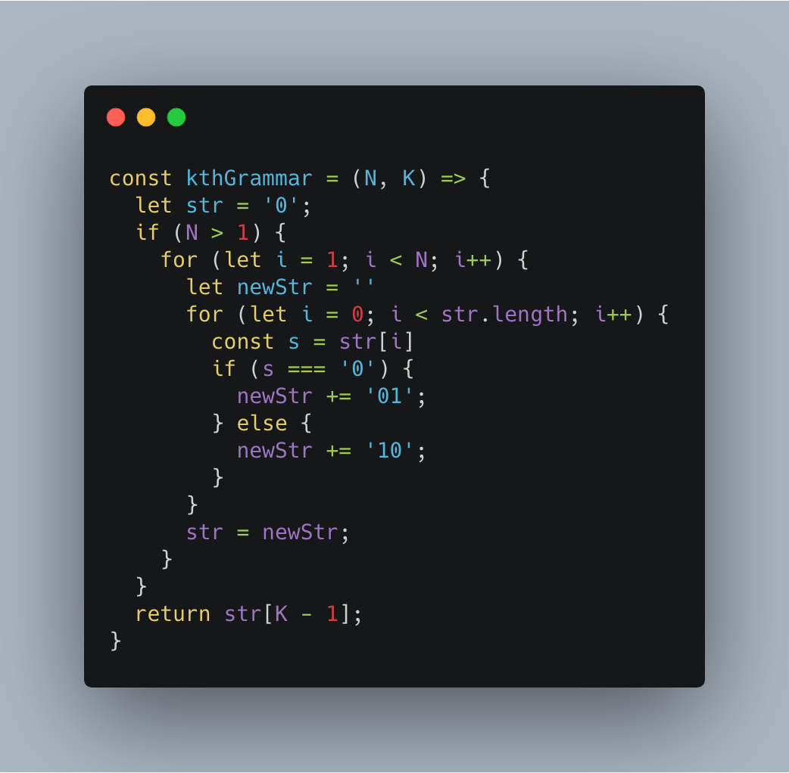
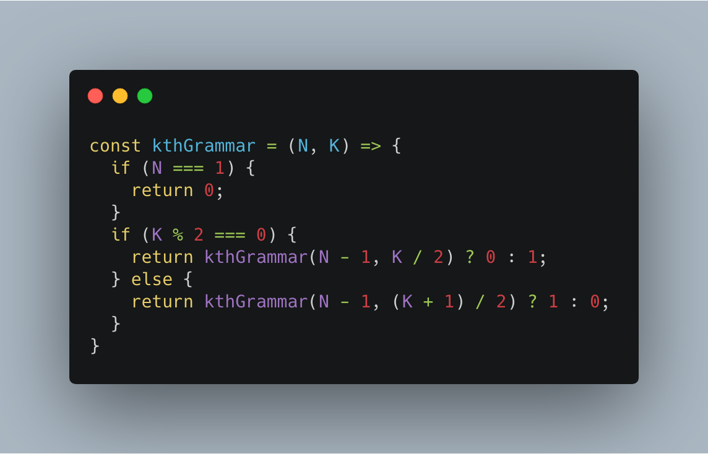

# 前端工程师的 LeetCode 之旅 -- 779. 第K个语法符号

### 一、题目大意

  &emsp;&emsp;在第一行我们写上一个 0。接下来的每一行，将前一行中的0替换为01，1替换为10。

  &emsp;&emsp;给定行数 N 和序数 K，返回第 N 行中第 K个字符。（**K从1开始**）

  &emsp;&emsp;例如：当 N 为 4 时，其字符串生成的过程如下：

  - 第一行：0
  - 第二行：01
  - 第三行：0110
  - 第四行：01101001

  &emsp;&emsp;那么当 N = 4，K = 5 的条件下，返回的字符为“1”。

### 二、解题思路

  &emsp;&emsp;理解上述题意，可以很容易想到如下解法：

  - 由第一行字符串递推出第 N 行字符串；
  - 取出第 K 个字符。

  

  &emsp;&emsp;上述解法虽然很容易理解，但是存在一个非常致命的问题：每一行包含 2^(N - 1) 个字符，当 N 稍微大一点，则会超出 JavaScript 字符串的最大长度。

### 三、正确解法

  &emsp;&emsp;上述解法通过正向递推求出当前行的字符串，既然现在无法保存当前行的字符串，那么是不是可以采用逆向递推的方法，最终确定第 K 个字符是 0 还是 1 呢！？

  &emsp;&emsp;仔细观察上述题目给出的递推条件：

```s
     0        1
    / \      / \
   0   1    1   0
```

  &emsp;&emsp;**对于任意一个第 N 行的字符都是替换为相应的两个字符，那么对于第 N + 1 行的任意一个字符，都可以计算得出其由第 N 行的第几个字符变化而来，并且可以根据 0 -> 01 和 1 -> 10 的规则，确定其是 0 还是 1**。

  

### 写在最后

  &emsp;&emsp;算法作为计算机的基础学科，用 JavaScript 刷，一点也不丢人ε=ε=ε=┏(゜ロ゜;)┛。

  &emsp;&emsp;本系列文章会分别给出一种算法的3种难度的总结篇（简单难度，中等难度以及困难难度）。在简单难度中，会介绍该算法的基本知识与实现，另外两个难度，着重讲解解题的思路。

  &emsp;&emsp;每篇总结中会选取部分重点题目讲解，完整解题清单详见[【前端工程师的 LeetCode 之旅】](https://github.com/15751165579/LeetCode)
  
  &emsp;&emsp;如果本文对您有所帮助，可以点赞或者关注来鼓励博主。