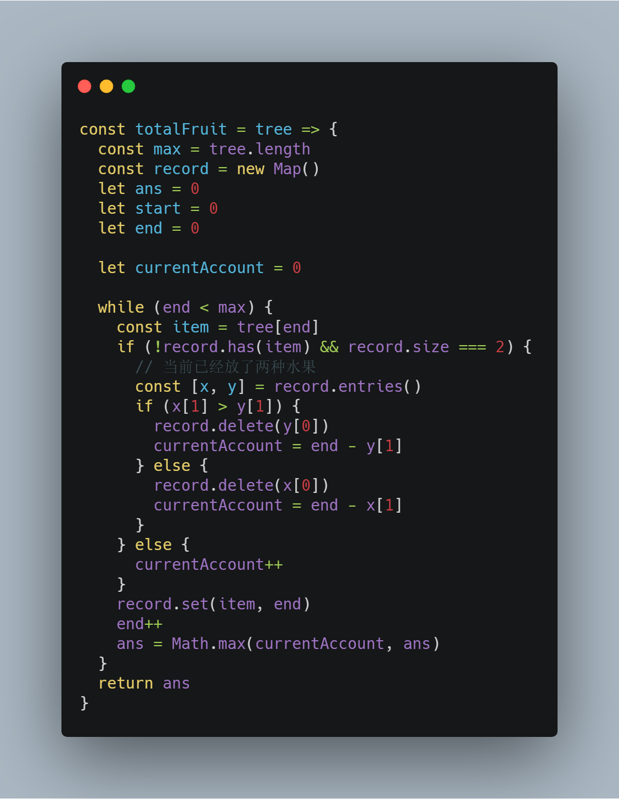
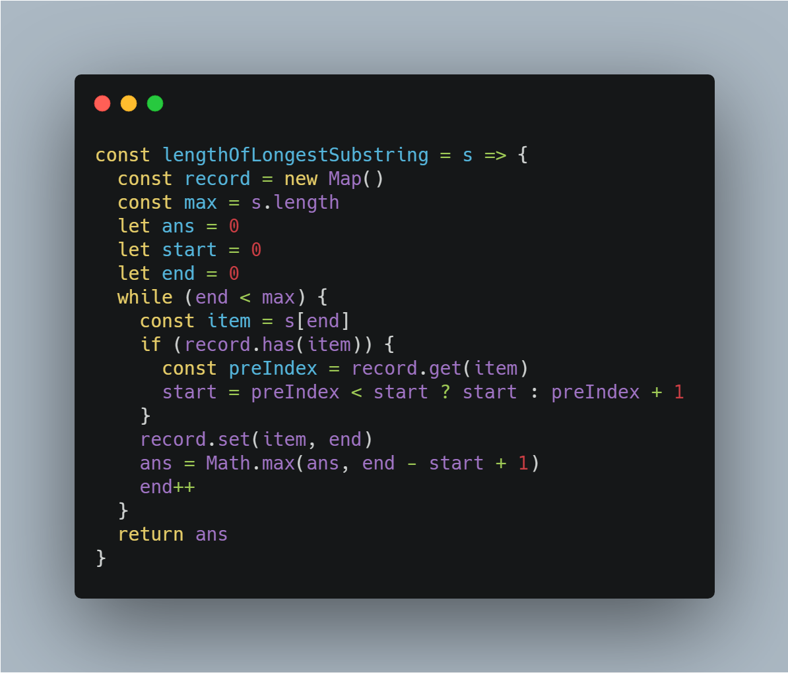
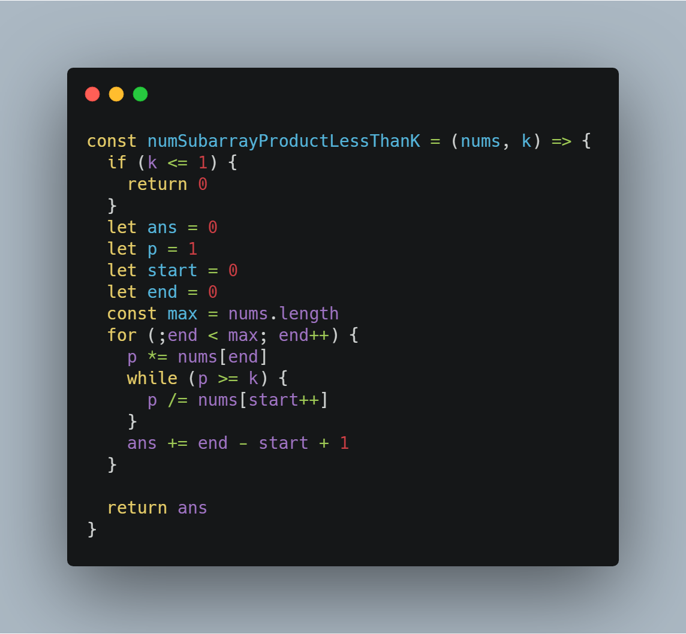
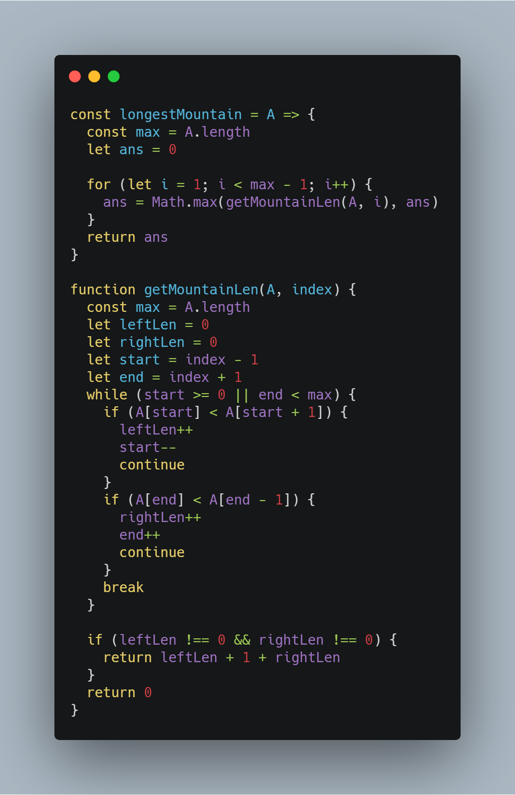
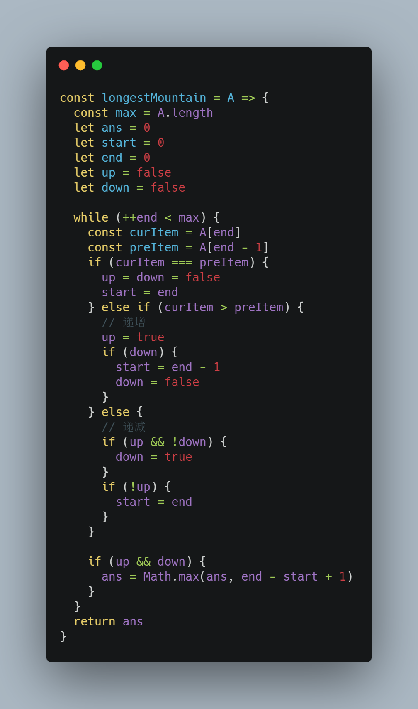

# 前端工程师的 LeetCode 之旅 -- 双指针技巧 Medium 篇（滑动窗口算法）

### 一、前言

   &emsp;&emsp;《双指针技巧 Easy 篇》中，简单地介绍了双指针技巧相比较单指针的优点，以及结合 Easy 难度的题目带大家进一步了解双指针的应用。

   &emsp;&emsp;进入 Medium 难度之后，解题的关键在于如何构造双指针以及确定指针移动的规则，解题方法可以归纳为以下两类：
   
   - **滑动窗口算法（Sliding Window Algorithm）**;
   - **对数组进行预处理（如：排序，前缀和等等），再利用双指针遍历**;

   &emsp;&emsp;这两种方法都可以将双循环问题转化为单循环问题，从而有效地降低算法的时间复杂度。本篇主要介绍滑动窗口算法以及相关题型的解题思路，第二类题型会放在下一篇中讲解。

   &emsp;&emsp;滑动窗口算法具体的表现形式为：**左右指针始终维护一个满足条件的窗口值，右指针负责向前遍历，当窗口值不满足条件时，将左指针指向的元素移出窗口，同时向前移动左指针。**

   &emsp;&emsp;下面，结合实际的题目来理解如何使用滑动窗口算法。

### 二、567. 字符串的排列

  > 给定两个字符串 s1 和 s2，写一个函数来判断 s2 是否包含 s1 的排列。换句话说，第一个字符串的排列之一是第二个字符串的子串。

  &emsp;&emsp;本道题目实际上可以转化为是否能找出满足以下条件的 s2 字符串的子串：

  - 该子串的长度和 s1 字符串的长度相等；
  - 该子串中包含的字符以及对应的数量和 s1 字符串相同；

  &emsp;&emsp;**那么结合滑动窗口算法，需要维护一个长度为 s1 字符串长度的窗口，并且窗口中的字符以及相应的数量与 s1 相同。**

  &emsp;&emsp;字符数量通过 HashTable 来维护，在 JavaScript 语言中可以采用 Map 数据结构。

  

### 三、904. 水果成篮

  > 在一排树中，第 i 棵树产生 tree[i] 型的水果。你可以从你选择的任何树开始，然后重复执行以下步骤：1、把这棵树上的水果放进你的篮子里。如果你做不到，就停下来。2、移动到当前树右侧的下一棵树。如果右边没有树，就停下来。请注意，在选择一颗树后，你没有任何选择：你必须执行步骤 1，然后执行步骤 2，然后返回步骤 1，然后执行步骤 2，依此类推，直至停止。你有两个篮子，每个篮子可以携带任何数量的水果，但你希望每个篮子只携带一种类型的水果。用这个程序你能收集的水果总量是多少？

  &emsp;&emsp;这道题很明显符合滑动窗口算法的特征：维护一个至多有两种水果的窗口。

  &emsp;&emsp;当窗口中出现第三种水果时，需要从窗口的左边依次移除果树，保证当前窗口只含有两种水果，这里可以采用 HashTable 记录同一类型果树最后出现的坐标来优化时间复杂度。

  &emsp;&emsp;最后，在窗口移动的过程中，计算相应的水果总量即可。

  

### 四、3. 无重复字符的最长子串

  > 给定一个字符串，请你找出其中不含有重复字符的 最长子串 的长度。

  &emsp;&emsp;这道题目与上一道《904. 水果成篮》的解题思路如出一撤：

  - **维护一个不含重复字符的窗口**；
  - **当窗口不满足条件时，从窗口右侧依次移除字符，确保窗口再次满足条件，同样可以采用 HashTable 记录相同字符最后出现的下标来优化时间复杂度**；

  

### 五、713. 乘积小于K的子数组

  > 给定一个正整数数组 nums。找出该数组内乘积小于 k 的连续的子数组的个数。

  &emsp;&emsp;本题需要维护一个乘积小于 k 的窗口，与上述题目相比，本题不需要太多技巧去计算有效的窗口值，它的难点在于**满足乘积的数组的长度正好是当前不重复子数组的数量**。

  

### 六、845. 数组中的最长山脉

  > 我们把数组 A 中符合下列属性的任意连续子数组 B 称为 “山脉”：1、B.length >= 3；2、存在 0 < i < B.length - 1 使得 B[0] < B[1] < ... B[i-1] < B[i] > B[i+1] > ... > B[B.length - 1]（注意：B 可以是 A 的任意子数组，包括整个数组 A。）给出一个整数数组 A，返回最长 “山脉” 的长度。如果不含有 “山脉” 则返回 0。

  &emsp;&emsp;以本题为例，感受一下朴素解法与滑动窗口算法之间的差距。

  &emsp;&emsp;朴素解法的思路：依次以数组中的元素为“峰顶”，如果满足“山脉”的条件，那么统计长度。

  

  &emsp;&emsp;上述代码的时间复杂度为 O(n^2)。

  &emsp;&emsp;本题利用滑动窗口算法的难点在于如何确定当前窗口中的有效“山脉”形态：

  - **窗口移动的过程中，需要采用两个变量来记录当前窗口中包含的序列的单调性；**
  - **窗口移动过程中遇到递增序列时，如果此时窗口中已经包含递减序列，那么需要向前移动左指针，重新构成“山脉”；**
  - **窗口移动过程中遇到递减序列时，如果此时窗口中不包含递增序列，同样需要向前移动左指针，重新构成“山脉”；**

  

  &emsp;&emsp;利用滑动窗口算法成功地将时间复杂度降低为 O(n)。

### 写在最后

  &emsp;&emsp;算法作为计算机的基础学科，用 JavaScript 刷，一点也不丢人ε=ε=ε=┏(゜ロ゜;)┛。

  &emsp;&emsp;本系列文章会分别给出一种算法的3种难度的总结篇（简单难度，中等难度以及困难难度）。在简单难度中，会介绍该算法的基本知识与实现，另外两个难度，着重讲解解题的思路。

  &emsp;&emsp;每篇总结中会选取部分重点题目讲解，完整解题清单详见[【前端工程师的 LeetCode 之旅】](https://github.com/15751165579/LeetCode)
  
  &emsp;&emsp;如果本文对您有所帮助，可以点赞或者关注来鼓励博主。

- [前端工程师的 LeetCode 之旅 -- 双指针技巧 Easy 篇](https://mp.weixin.qq.com/s/SXj8tkGj19gZy3EgTPIy2Q)
- [前端工程师的 LeetCode 之旅](https://github.com/15751165579/LeetCode)

