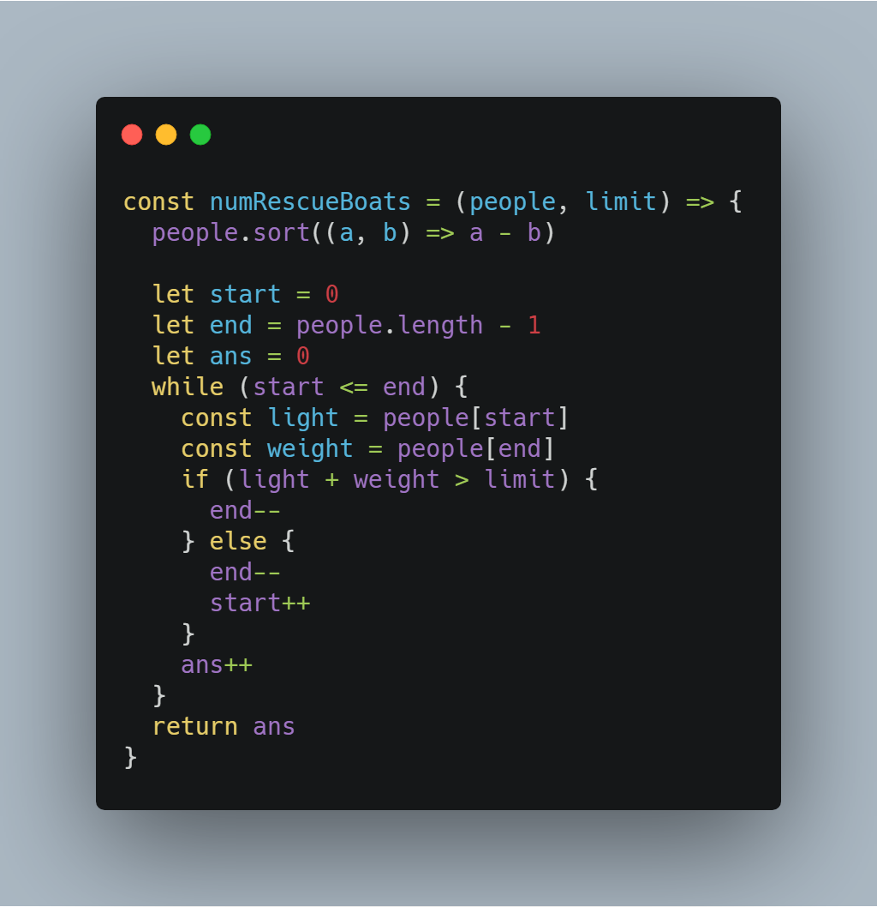
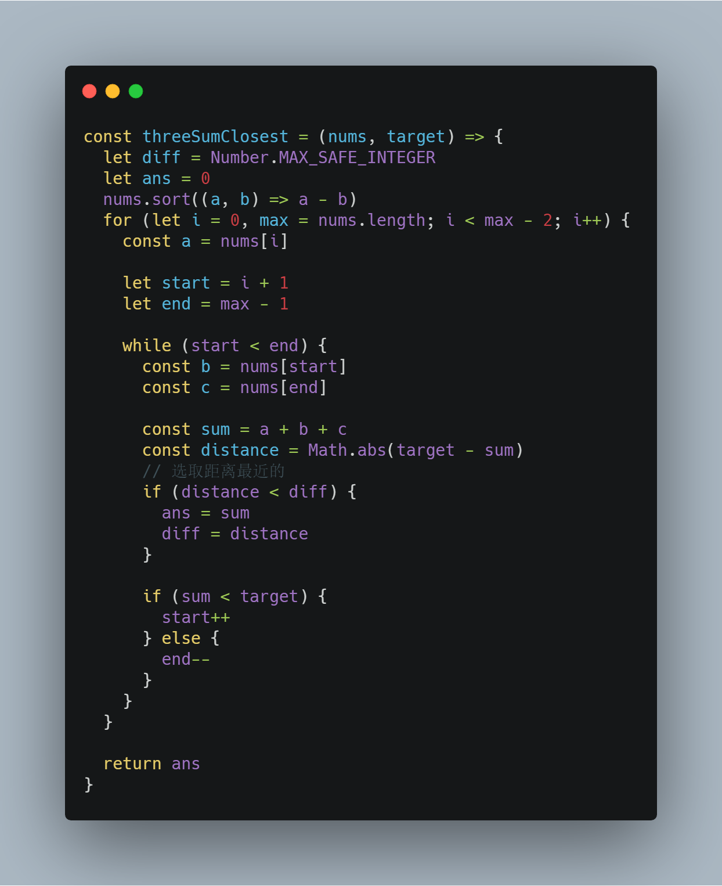
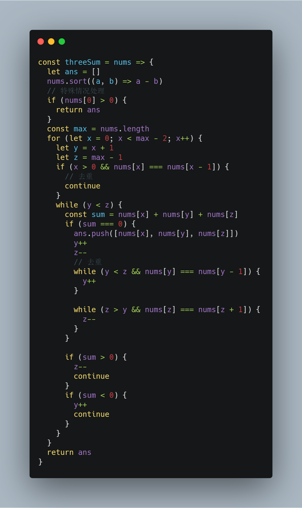
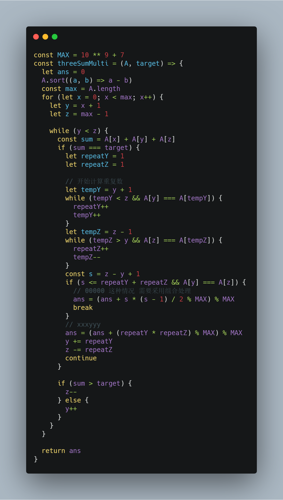
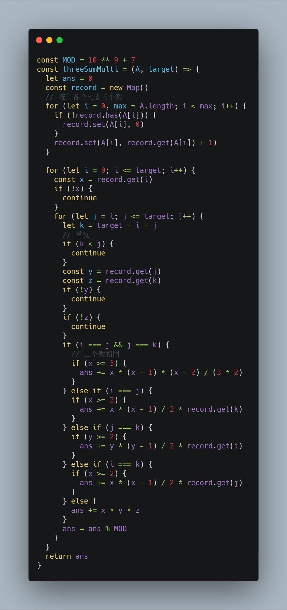
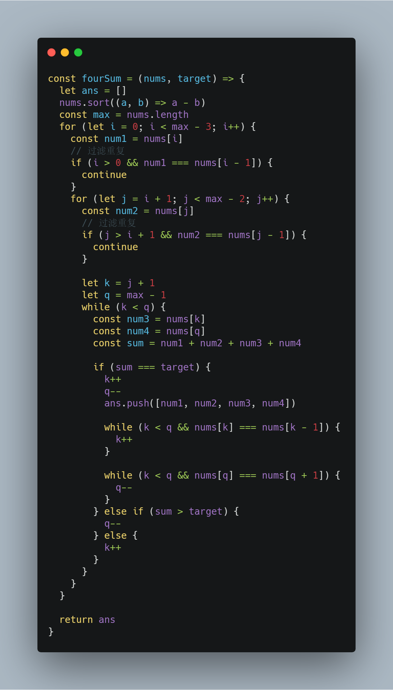

# 前端工程师的 LeetCode 之旅 -- 双指针技巧 Medium 篇（下）

### 一、前言

  &emsp;&emsp;本篇主要介绍双指针技巧的第二类题型：对数组进行预处理之后，再采用双指针遍历。

  &emsp;&emsp;在 Medium 难度的题目中，此类问题可以归纳为 K-Sum 问题：

  - 两数之和：【881. 救生艇】；
  - 三数之和：【16. 最接近的三数之和】、【15. 三数之和】、【923. 三数之和的多种可能】；
  - 四数之和：【18. 四数之和】；

#### 二、881. 救生艇

  > 第 i 个人的体重为 people[i]，每艘船可以承载的最大重量为 limit。每艘船最多可同时载两人，但条件是这些人的重量之和最多为 limit。返回载到每一个人所需的最小船数。(保证每个人都能被船载)。

  &emsp;&emsp;由题意可知，保证所需的最小船数，意味着每一趟尽可能地搭载两个人，并且他们的重量最接近最大重量，以便后续趟次能够组成两个人。

  &emsp;&emsp;所以现在解题的关键就是每趟从数组中尽可能地找出一个最大值和最小值的和值小于最大重量，所以这里必须对原数组进行排序。

  &emsp;&emsp;数组排序之后，很容易可以从左侧找到最小值，右侧找到最大值，那么通过双指针向中间遍历，即可解题。

  

### 三、16. 最接近的三数之和

  >给定一个包括 n 个整数的数组 nums 和 一个目标值 target。找出 nums 中的三个整数，使得它们的和与 target 最接近。返回这三个数的和，假定每组输入只存在唯一答案。

  &emsp;&emsp;朴素解法就是通过三层循环枚举各种排列来找到最接近的和值，时间复杂度为 O(n^3)。

  &emsp;&emsp;这里可以利用**降维思想**，将其转化为两数之和的问题，那么解题思路和【881. 救生艇】如出一辙：

  

  &emsp;&emsp;时间复杂度被降低为 O(nlogn+n^2)。

### 四、15. 三数之和

  > 给定一个包含 n 个整数的数组 nums，判断 nums 中是否存在三个元素 a，b，c ，使得 a + b + c = 0 ？找出所有满足条件且不重复的三元组。

  &emsp;&emsp;再看这道题目，是不是会立即想到解题范式：

  - **降维思想，将三数之和的问题转化为两数之和的问题；**
  - **对数组进行排序，将双循环问题转化为单循环问题；**

  &emsp;&emsp;对于不重复三元素组这一条件，同学们第一时间可能会想到采用 HashTable 来去重，但是整个双指针解题的过程中，三个数始终保持着非递减序列的特性，那么只要将重复的数字过滤掉即可去重。

  

### 五、923. 三数之和的多种可能

  > 给定一个整数数组 A，以及一个整数 target 作为目标值，返回满足 i < j < k 且 A[i] + A[j] + A[k] == target 的元组 i, j, k 的数量。

##### 1、双指针解法

  &emsp;&emsp;本题的难度在于：**含有重复数字时，双指针无法完整地统计出两数之和的所有排列**。

  &emsp;&emsp;以数组 [2, 2, 6, 6] 为例，寻找和值为 8 时，无论你怎么设置双指针的移动规则，只能得出两组和值为 8 的组合，所以对于重复元素就必须得利用排列组合相关的数学知识来处理。

  &emsp;&emsp;仍然以和值 8 为例，会有如下两种情况：

  - 如果数组的形式为 [2, 2, 6, 6]，那么排列组合数就是 2 * 2；
  - 如果数组的形式为 [4, 4, 4, 4]，那么排列组合数就是 4 * 3 / 2（4个中取2个）；

  &emsp;&emsp;那么当寻找到满足条件的和值之后，还需要将双指针再次向前移动，找出相应的个数，来计算其组合数：

  

  &emsp;&emsp;从上述代码中可以发现计算重复数组合的部分非常复杂。

##### 2、数学方法 -- 组合

  &emsp;&emsp;现在，同学们可以尝试**逆向思维：枚举所有和值为目标值的三元组，那么只要知道三元组中的数字在数组 A 中的数量，即可通过组合计算出来**。

  &emsp;&emsp;相比较数组 A，target 则小很多，那么时间复杂度可以大大地降低为 O(n+target^2)，另外需要 O(n) 的时间复杂度来存储数组 A 中数字的个数。

  

### 六、18. 四数之和

  > 给定一个包含 n 个整数的数组 nums 和一个目标值 target，判断 nums 中是否存在四个元素 a，b，c 和 d ，使得 a + b + c + d 的值与 target 相等？找出所有满足条件且不重复的四元组。

  &emsp;&emsp;理解【15. 三数之和】的解题思路之后，这道题目本质上的区别就是多一个循环。

  

### 写在最后

  &emsp;&emsp;算法作为计算机的基础学科，用 JavaScript 刷，一点也不丢人ε=ε=ε=┏(゜ロ゜;)┛。

  &emsp;&emsp;本系列文章会分别给出一种算法的3种难度的总结篇（简单难度，中等难度以及困难难度）。在简单难度中，会介绍该算法的基本知识与实现，另外两个难度，着重讲解解题的思路。

  &emsp;&emsp;每篇总结中会选取部分重点题目讲解，完整解题清单详见[【前端工程师的 LeetCode 之旅】](https://github.com/15751165579/LeetCode)
  
  &emsp;&emsp;如果本文对您有所帮助，可以点赞或者关注来鼓励博主。

- [前端工程师的 LeetCode 之旅 -- 双指针技巧 Easy 篇](https://mp.weixin.qq.com/s/SXj8tkGj19gZy3EgTPIy2Q)
- [前端工程师的 LeetCode 之旅 -- 双指针技巧 Medium 篇（滑动窗口算法）](https://mp.weixin.qq.com/s/5qHKabjsb0FKvfp2y7CgTg)
- [前端工程师的 LeetCode 之旅](https://github.com/15751165579/LeetCode)
