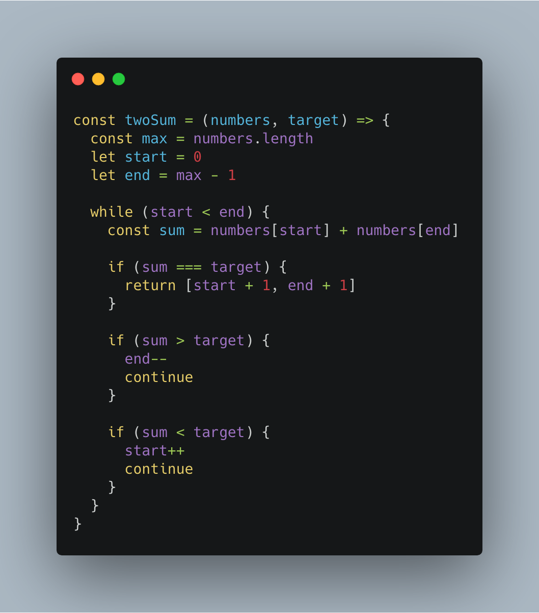
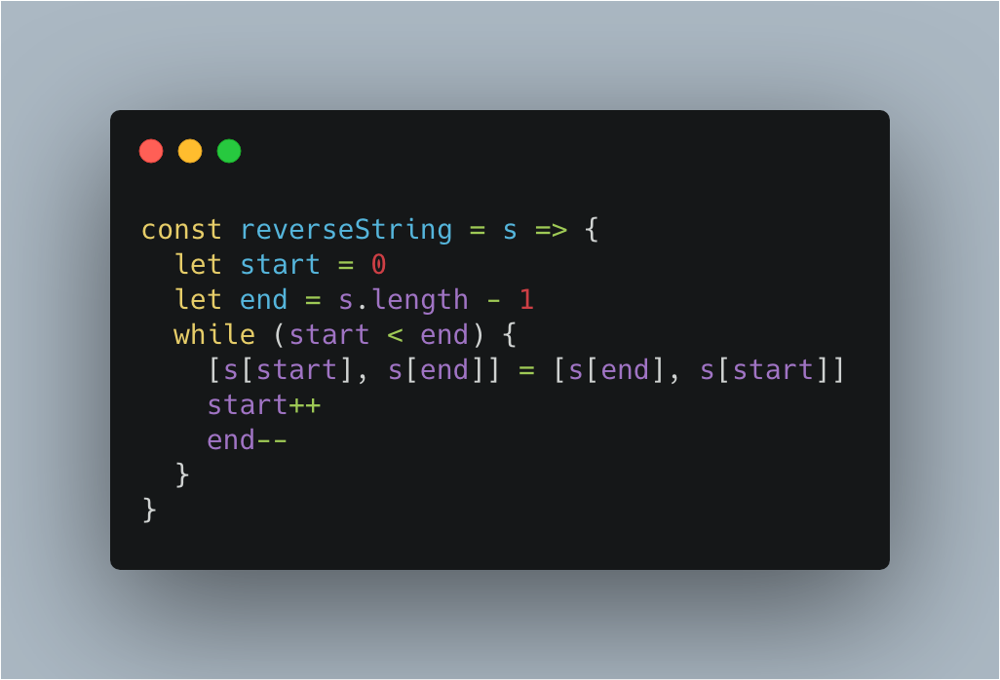
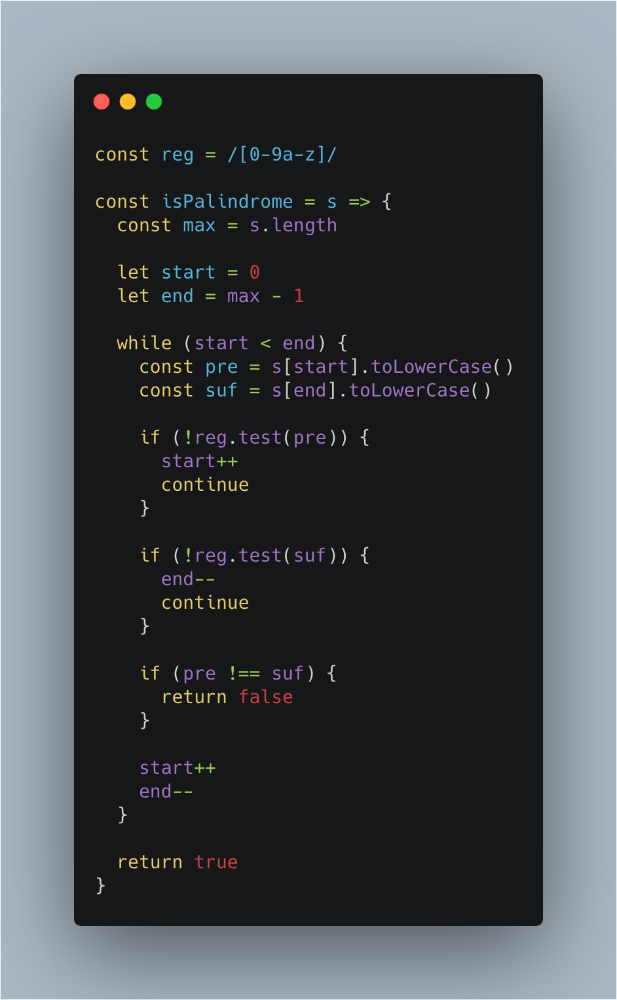
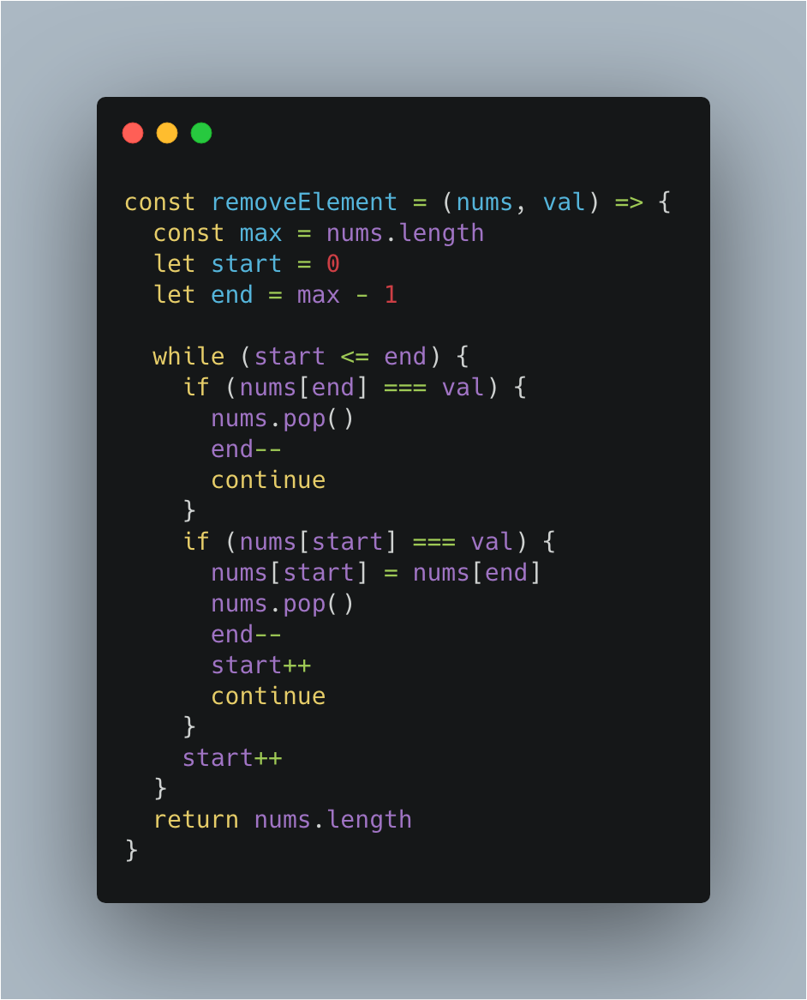

# 前端工程师的 LeetCode 之旅 -- 双指针技巧 Easy 篇

### 一、前言

  &emsp;&emsp;一般情况下，遍历数组（或者字符串）操作，都是采用单指针从前往后或者从后往前依次访问数组（或者字符串）中的元素。

  &emsp;&emsp;而对于以下情况，只采用单指针处理，则会徒增时间复杂度和空间复杂度：

  - 例如：找到两个数使得它们相加之和等于目标数，采用单指针处理，则需要嵌套循环，使得时间复杂度增长为 O(n^2)；
  - 再例如：翻转数组，采用单指针处理，则需要额外内存空间，使得空间复杂度增长为 O(n)；

  &emsp;&emsp;利用双指针技巧则可以优化上述解决方案：

  - 第一个例子：可以先对采用数组进行排序预处理，再创建前后指针向中间遍历，遍历的时间复杂度为 O(n)，整体时间复杂度主要取决于排序算法，通常为 O(nlogn)；
  - 第二个列子：一个指针负责遍历，另外一个指针负责交换元素，从而使得空间复杂度为 O(1)；

  &emsp;&emsp;双指针没有复杂的定义，总结起来主要处理两类问题：

  - **将嵌套循环转化为单循环问题**；
  - **通过指针记录状态，从而优化空间复杂度**；

  &emsp;&emsp;下面的实战分析会让你感受双指针的威力。

### 二、167. 两数之和 II - 输入有序数组

  > 给定一个已按照升序排列 的有序数组，找到两个数使得它们相加之和等于目标数。函数应该返回这两个下标值 index1 和 index2，其中 index1 必须小于 index2。

  &emsp;&emsp;这道题目采用单指针的做法只能通过嵌套循环枚举所有两数之和的方法来解决，时间复杂度为 O(n^2)。

  &emsp;&emsp;恰巧本题中的数组已经是有序数组，那么直接创建前后指针：

  - **如果两数之后大于 target，尾指针向前移动；**
  - **如果两数之和小于 target，头指针向后移动；**

  

  &emsp;&emsp;上述代码利用双指针技巧成功地将时间复杂度降低为 O(n)。

### 三、344. 反转字符串

  > 编写一个函数，其作用是将输入的字符串反转过来。输入字符串以字符数组 char[] 的形式给出。

  &emsp;&emsp;本题采用单指针的方法，需要创建一个额外的数组来保存翻转后的元素，空间复杂度为 O(n)。

  &emsp;&emsp;**利用双指针技巧，则可以在遍历的过程中同时完成交换元素的操作，时间复杂度降低为 O(1)**：

  

  &emsp;&emsp;相同类型的题目还有：

  - 【345. 反转字符串中的元音字母】

### 四、141. 环形链表

  > 给定一个链表，判断链表中是否有环。为了表示给定链表中的环，我们使用整数 pos 来表示链表尾连接到链表中的位置（索引从 0 开始）。 如果 pos 是 -1，则在该链表中没有环。

  &emsp;&emsp;在链表这种数据结构中，采用前文所说的前后指针并不一定有效（例如单向链表），这种情况下，双指针的表现形式为：**快慢指针**。

  &emsp;&emsp;快慢指针指的是：设置两个前进方向相同但速度不同的指针。

  &emsp;&emsp;本题中，设置每次移动一个单位的慢指针和每次移动两个单位的快指针，那么他们必定会在环内相遇：

  

  &emsp;&emsp;相同类型的题目还有：

  - 【26. 删除排序数组中的重复项】

### 五、125. 验证回文串

  > 给定一个字符串，验证它是否是回文串，只考虑字母和数字字符，可以忽略字母的大小写。说明：本题中，我们将空字符串定义为有效的回文串。

  &emsp;&emsp;回文字符串问题是双指针的经典应用，同时也是面试题中的常客。

  

### 六、27. 移除元素

  > 给定一个数组 nums 和一个值 val，你需要原地移除所有数值等于 val 的元素，返回移除后数组的新长度。不要使用额外的数组空间，你必须在原地修改输入数组并在使用 O(1) 额外空间的条件下完成。元素的顺序可以改变。你不需要考虑数组中超出新长度后面的元素。

  &emsp;&emsp;显而易见的解决方法是通过 while + splice 处理，但是 **splice 操作方法是非常耗时的，每次删除元素之后，需要重排数组中的元素**，具有相同副作用的操作方法还有 unshift 和 shift 。（具体可以查看 V8 源码）

  &emsp;&emsp;相比较下，pop 和 push 则是非常快的操作方法，这里可以采用双指针 + pop 操作方法，进一步优化时间复杂度：

  

### 写在最后

  &emsp;&emsp;算法作为计算机的基础学科，用 JavaScript 刷，一点也不丢人ε=ε=ε=┏(゜ロ゜;)┛。

  &emsp;&emsp;本系列文章会分别给出一种算法的3种难度的总结篇（简单难度，中等难度以及困难难度）。在简单难度中，会介绍该算法的基本知识与实现，另外两个难度，着重讲解解题的思路。

  &emsp;&emsp;每篇总结中会选取部分重点题目讲解，完整解题清单详见[【前端工程师的 LeetCode 之旅】](https://github.com/15751165579/LeetCode)
  
  &emsp;&emsp;如果本文对您有所帮助，可以点赞或者关注来鼓励博主。

- [前端工程师的 LeetCode 之旅 -- 二分搜索Easy篇](https://mp.weixin.qq.com/s/D6zY08tJ8J-nhIA4u86IoA)
- [前端工程师的 LeetCode 之旅](https://github.com/15751165579/LeetCode)

