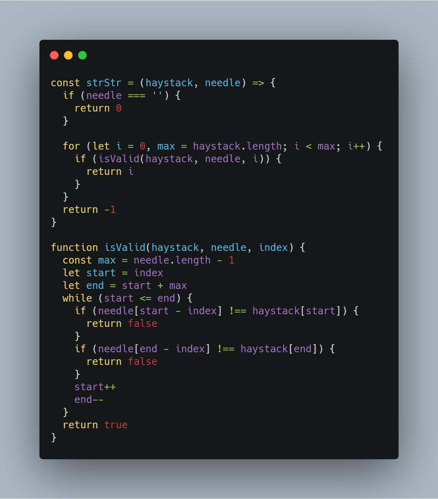
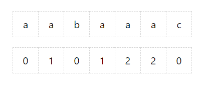
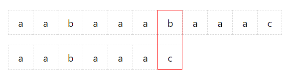
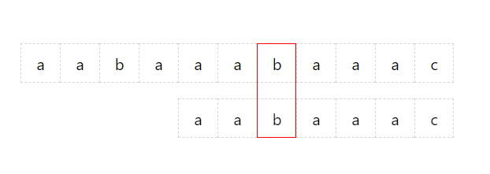
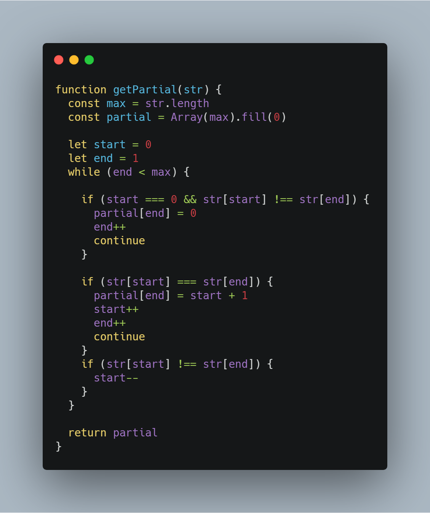
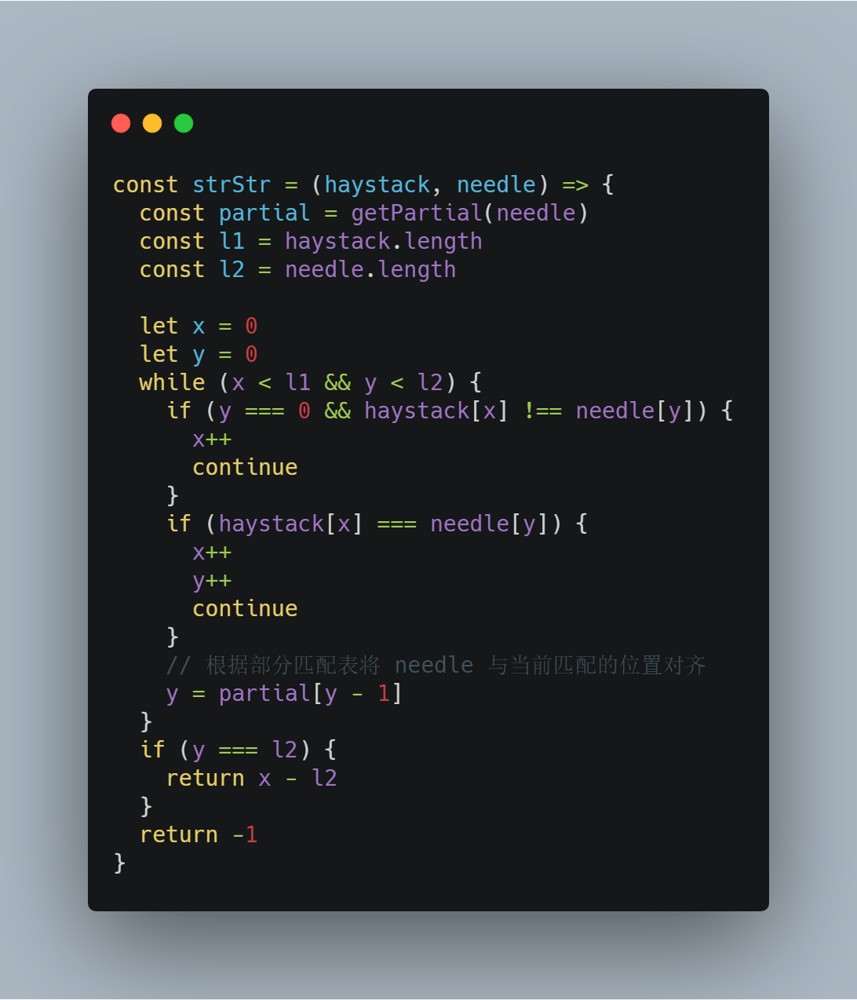

# 前端工程师的 LeetCode 之旅 -- KMP 字符串匹配算法

### 一、前言

  > 给定一个 haystack 字符串和一个 needle 字符串，在 haystack 字符串中找出 needle 字符串出现的第一个位置 (从0开始)。如果不存在，则返回  -1。

  &emsp;&emsp;这是双指针 Easy 篇中的【28. 实现strStr()】，虽然是一道 Easy 标签的题目，但是字符串匹配作为计算机科学中研究最广泛的问题之一，相关的算法实现也非常多。

  &emsp;&emsp;本篇文章主要带大家了解 KMP 字符串匹配算法的执行流程以及代码实现。

### 二、朴素字符串匹配算法

  &emsp;&emsp;在介绍 KMP 字符串匹配算法之前，首先了解一下朴素字符串匹配算法的实现：

  

  &emsp;&emsp;上述代码的思路是：采用 needle 字符串依次与 haystack 字符串中的子串进行匹配，时间复杂度为 O(nm)。

### 三、KMP 字符串匹配算法

##### 1、KMP 算法执行流程

```s
  haystack: aabaaabaaac
    needle: aabaaac
```

  &emsp;&emsp;以上述 haystack 和 needle 为例，带大家走一遍 KMP 算法执行的流程。

  &emsp;&emsp;在执行 KMP 字符串匹配算法之前，需要对 needle 进行预处理，计算出 needle 的部分匹配表：

  

  &emsp;&emsp;**这张表记录的是 needle 字符串中所有前缀的不完全前后缀的最长公共字符串的长度**（比较拗口,,ԾㅂԾ,,）。

  &emsp;&emsp;needle 字符串中的前缀有: a, aa, aab, aaba, aabaa, aabaaa, aabaaac。

  &emsp;&emsp;以前缀 aabaa 为例：

  - 不完全前缀包括 a, aa, aab, aaba;
  - 不完全后缀包括 a, aa, baa, abaa;

  &emsp;&emsp;所以 aabaa 不完全前后缀的最长公共字符串的长度为 2。

  &emsp;&emsp;了解部分匹配表的概念之后，进行第一轮匹配:

  

  &emsp;&emsp;如上图所示，此时 needle 字符串并不能被匹配上，按照朴素匹配算法应该将 haystack 中的开始指针向后移动一位，并且再依次比较 haystack 和 needle 字符串。

  &emsp;&emsp;与朴素匹配算法不同的是，KMP 算法会先根据部分匹配表得到当前位置的最长公共字符串的长度（由上述部分匹配表可得到最大长度为 2），然后再将 needle 字符串下标为 2 的位置与当前 haystack 匹配的位置对齐，并且不用再从头开始依次匹配，直接从该位置向后匹配即可：

  

  &emsp;&emsp;这样，KMP 算法在第二轮就可以确定字符串匹配的结果。

  &emsp;&emsp;相比较朴素字符串匹配算法的时间复杂度，KMP 字符串匹配算法将时间复杂度降低为 O(n+m)。

##### 2、部分匹配表算法的实现

  &emsp;&emsp;部分匹配表是整个 KMP 算法的核心，实现它也是采用双指针技巧：

  - **创建两个前后指针：start 和 end**；
  - **start 指针主要负责当前前缀中不完全前后缀的最长公共字符串在不完全前缀中的位置**；
  - **end 指针主要负责遍历 needle 中的前缀**；

  

##### 3、KMP 字符串匹配算法的实现

  &emsp;&emsp;KMP 字符串匹配算法在整体的匹配过程中同样要用到双指针技巧：

  - 一个指针负责遍历 haystack 字符串；
  - 一个指针负责遍历 needle 字符串；

  &emsp;&emsp;如果 haystack 字符串中指针所在的字符与 needle 中指针所在的字符不相等，那么就需要查询部分匹配表，将 needle 字符串中的指针移动到相应的位置，进行下一轮匹配：

  

  &emsp;&emsp;到此，我们就实现了 KMP 字符串匹配算法，如果博主粗糙的讲解让你仍然疑惑不解，可以搜索以下参考文献：

  - [阮一峰的网络日志:字符串匹配的KMP算法](http://www.ruanyifeng.com/blog/2013/05/Knuth%E2%80%93Morris%E2%80%93Pratt_algorithm.html)
  - [The Knuth-Morris-Pratt Algorithm in my own words](http://jakeboxer.com/blog/2009/12/13/the-knuth-morris-pratt-algorithm-in-my-own-words/)

### 写在最后

  &emsp;&emsp;算法作为计算机的基础学科，用 JavaScript 刷，一点也不丢人ε=ε=ε=┏(゜ロ゜;)┛。

  &emsp;&emsp;本系列文章会分别给出一种算法的3种难度的总结篇（简单难度，中等难度以及困难难度）。在简单难度中，会介绍该算法的基本知识与实现，另外两个难度，着重讲解解题的思路。

  &emsp;&emsp;每篇总结中会选取部分重点题目讲解，完整解题清单详见[【前端工程师的 LeetCode 之旅】](https://github.com/15751165579/LeetCode)
  
  &emsp;&emsp;如果本文对您有所帮助，可以点赞或者关注来鼓励博主。

- [前端工程师的 LeetCode 之旅 -- 双指针技巧 Easy 篇](https://mp.weixin.qq.com/s/SXj8tkGj19gZy3EgTPIy2Q)
- [前端工程师的 LeetCode 之旅](https://github.com/15751165579/LeetCode)