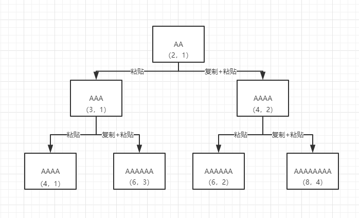

# [650. 2 Keys Keyboard](https://leetcode.com/problems/2-keys-keyboard/)

### 一、解题思路

  &emsp;&emsp;读完题目之后，需要知道以下几点：

  - 当n=1时，默认提供一个'A'，不需要做任何操作。
  - 当n=2时，必须执行一次复制'A'的操作。
  - 当n>2时，要么执行操作，要么执行复制+粘贴的操作。

  &emsp;&emsp;实际上你会发现当n>2时，执行操作的所有可能性是一颗二叉树：

  

  &emsp;&emsp;那么利用递归就可以很轻松的解决这样的问题：

### 二、代码实现

```JavaScript
const minSteps = n => {
  if (n === 1) {
    return 0
  }
  if (n === 2) {
    return 2
  }
  let ans = 2
  help(2, 1, 2)
  return ans
  function help (length, copyLength, step) {
    if (length === n) {
      ans = step
      return
    }
    if (length > n) {
      return
    }
    // 不复制的情况
    help(length + copyLength, copyLength, step + 1)

    // 复制 + 粘贴
    help(length * 2, length, step + 2)
  }
}
```